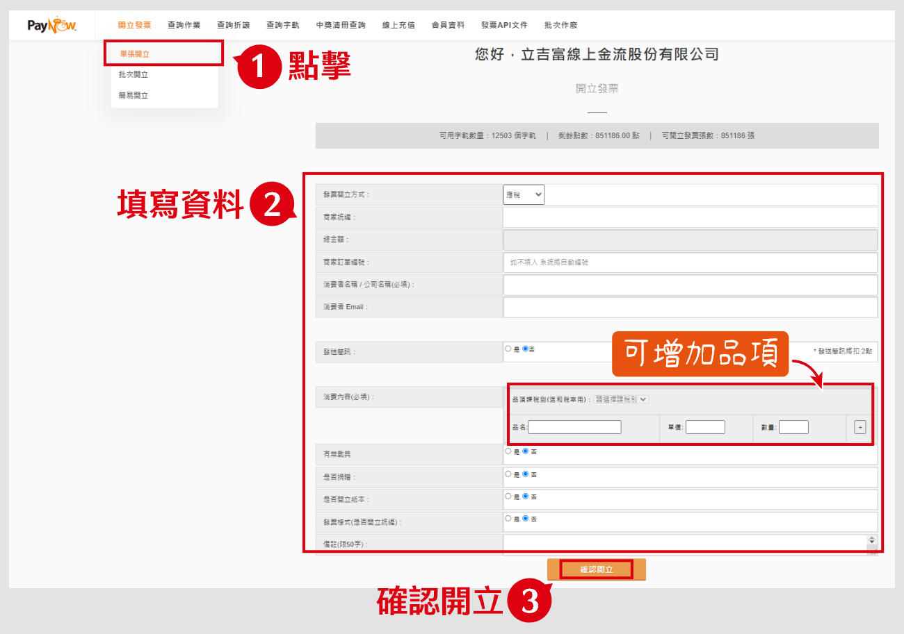
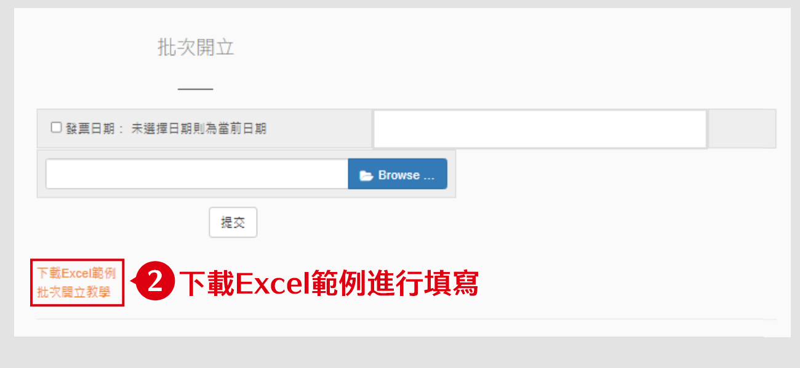
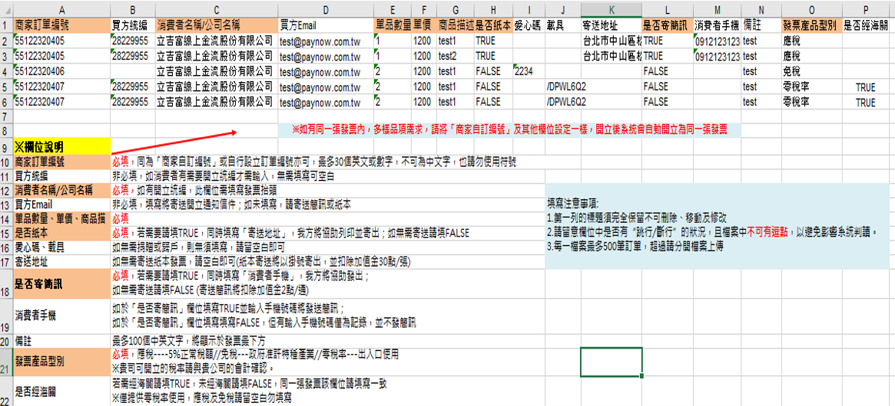
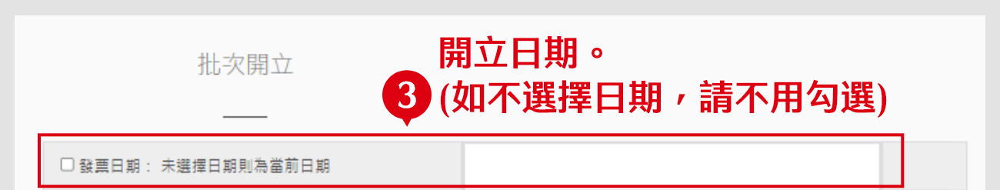
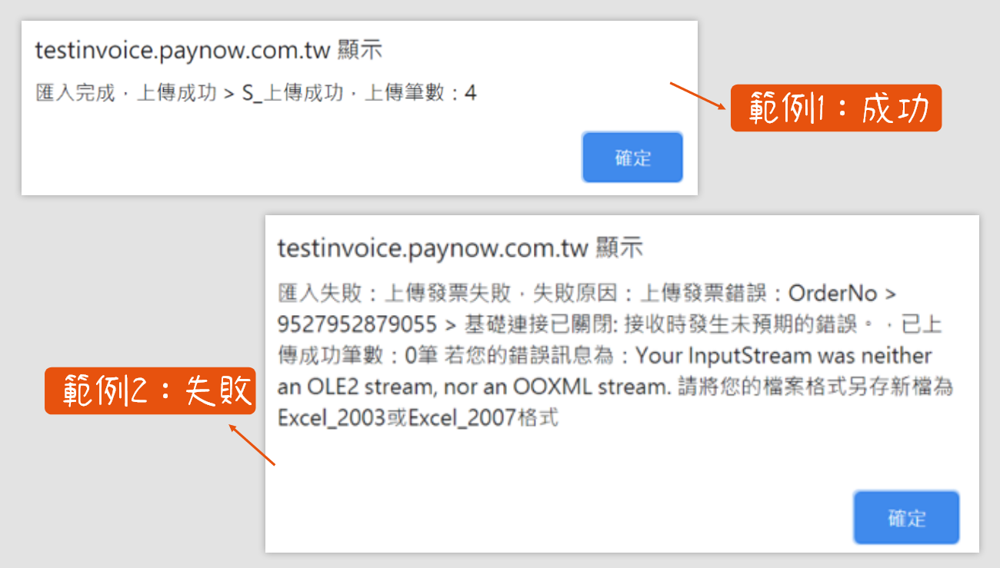
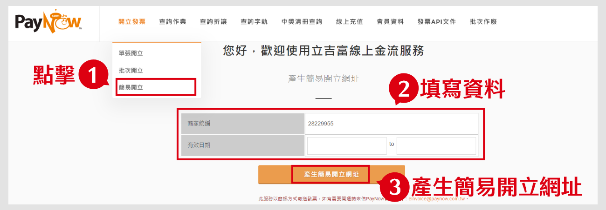

# 發票開立

:::info 摘要
當買家從您的商店購買商品後，您可以在 PayNow 頁面開立發票給買家。
:::

## 如何開立單張發票

按照下方步驟：
1. 點擊「開立發票」>「單張開立」
2. 填寫發票資料(總金額無需填寫，系統將於開立時依品項單價、數量自動計算)
3. 確認開立

:::tip 備註
在「消費內容」欄位，可點擊「+」增加發票品項。
:::

## 如何批次開立發票

按照下方步驟：
### 1. 點擊「開立發票」>「批次開立」

### 2. 下載 Excel 範例進行填寫

:::tip 備註
1. Excel 範例檔案將不定期更新，請於每次開立發票前重新下載最新版檔案使用。

2. Excel 範例檔內容如下圖

:::

### 3. 勾選開立日期
同一期內的發票都可往前選擇日期開立。如不勾選日期，開立日期預設為當日。

### 4. 點擊「Browse」夾帶檔案，並點擊「提交」

點擊「提交」後，請勿重複點擊按鈕，需等待系統跳出成功/失敗通知在關閉視窗。

成功/失敗通知，範例如下

:::warning 請注意
1. 上傳檔案前，請務必檢查檔案內容是否正確，且必填欄位都有填寫完成。

2. 確認無誤後即可提交檔案，一旦上傳則無法中止，系統會逐筆判讀，全部資料皆沒有問題時，系統才會一次開立成功。

3. 上傳時，網路不可中斷，檔案僅支援「97-2003工作表(.xls)」，如檔案版本錯誤則無法上傳，且提交檔案請勿連續點擊按鈕，並等候系統跳出成功/失敗訊息。

4. 如有遇到錯誤，系統會跳出提醒視窗告知錯誤的地方，若無法理解錯誤訊息(如上圖範例)，請務必截圖並連同 Excel 檔案寄至`einvoice@paynow.com.tw`，人員將儘快為您查詢。
:::

## 如何簡易開立發票

:::caution 前提條件
此服務是以「簡訊」方式寄出發票通知，需開通後才能使用。

如有需要請來信 PayNow 信箱 `einvoice@paynow.com.tw` 申請
:::

按照下方步驟：
1. 點擊「開立發票」>「簡易開立」
2. 填寫資料
3. 點擊「產生簡易開立網址」

