# 一頁式購物車

:::info 摘要
讓您讓您輕鬆上架產品並建立一頁式購物網頁，方便客戶下單購買。另外，我們提供簡單易用的產品管理後台，讓您在業務發展中省時省力。
:::

:::caution 前提條件
您已經登入 PayNow 後台系統。
:::

## 如何新增一頁式購物車

按照下方步驟。

### 1. 點擊「一頁式」>「新增產品」

### 2. 點擊「增加銷售網址」

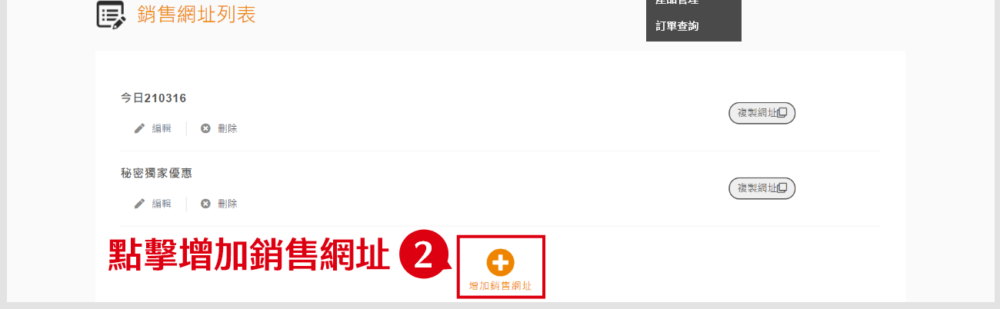

## 如何新增商品

:::caution 前提條件
您已經建立 1 個一頁式購物車銷售網址。
:::

### 1. 依照畫面指示，填寫商品資訊

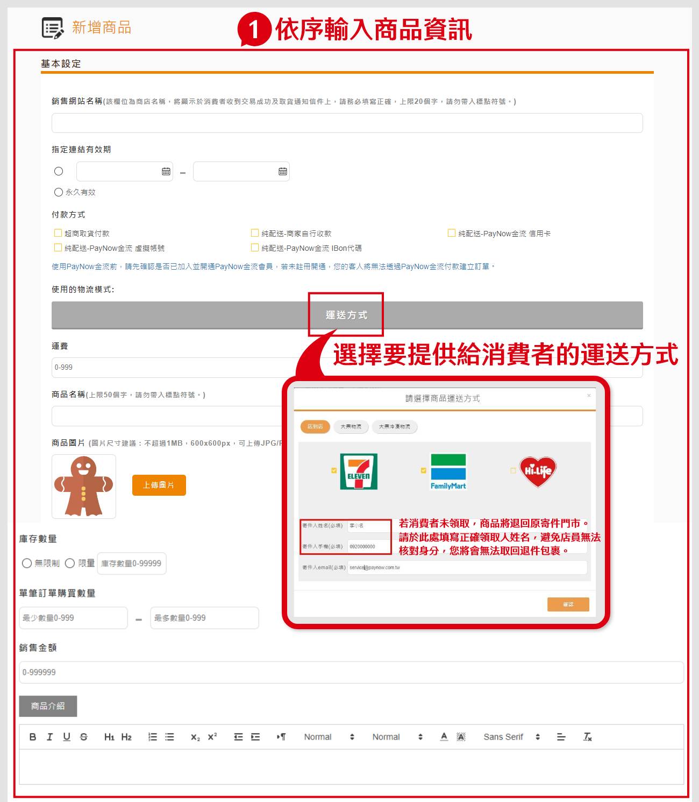

:::tip 備註
點擊「運送方式」，可選擇要提供給消費者的運送方式。消費者若未領取，商品將退回原寄件門市，請務必正確填寫領取人姓名。
:::

### 2.點擊「新增商品」繼續新增
如同時有多樣商品，可點擊「新增商品」按鈕繼續新增。

### 3. 設定「加密訂單」
商家可自由決定是否使用加密訂單。如需將商品網址加密，請勾選左下方加密設定欄位。

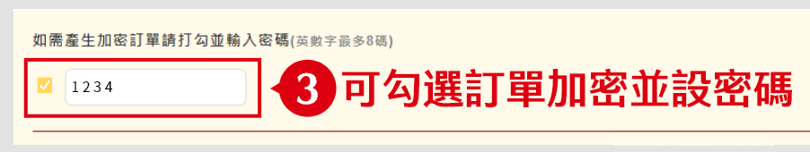

下方為無加密/加密後的頁面範例。

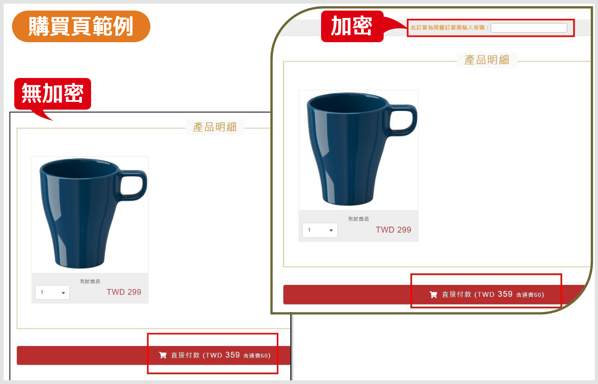

### 4. 點擊「產生網址」新增商品

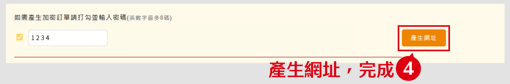

### 5. 新增成功後按OK

### 6. 產生連結後可點擊“複製連結”以提供給消費者

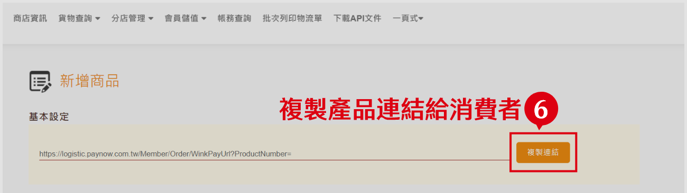

## 如何管理產品

按照下方步驟。

### 1.點擊「一頁式」>「產品管理」

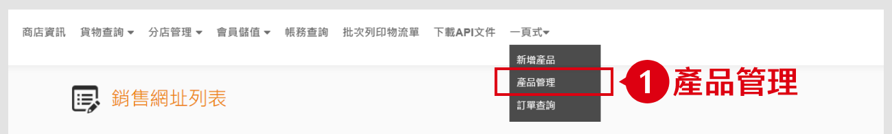

### 2.在 "銷售網址列表頁" 左側，可新增與刪除產品

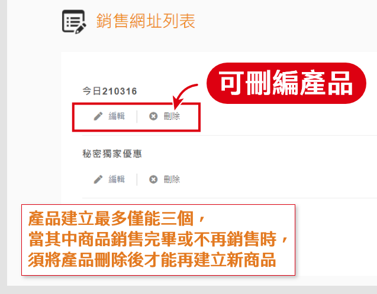

:::tip 備註
您最多只能建立三個產品銷售網址。
:::

## 如何查詢訂單

按照下方步驟。

### 1.點擊「一頁式」>「訂單查詢」

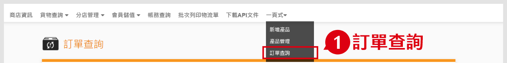

### 2.依需求輸入搜尋條件

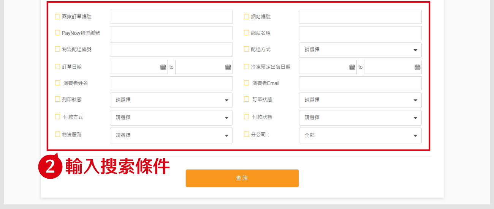

### 3.點擊「查詢」

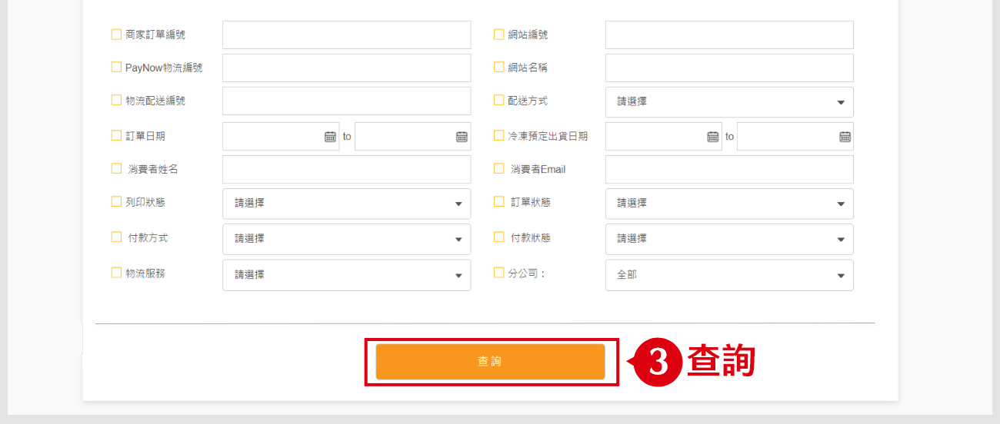

## 如何列印標籤

:::caution 前提條件
您的產品已經出貨。
:::

在產品明細右方，點擊「列印」按鈕

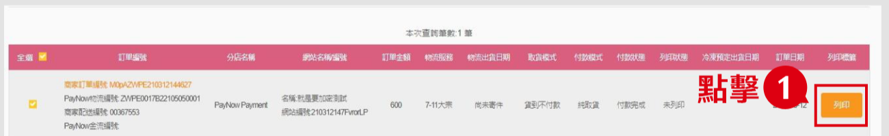

:::tip 備註
- 建議用雷射印表機，紙張只能白色。
- 若為“冷凍物流”請使用防水貼紙，一般紙張請套防水袋
:::

## 如何查詢訂單的物流狀態

按照下方步驟。

### 1. 點擊「貨物查詢」>「物流狀態查詢」

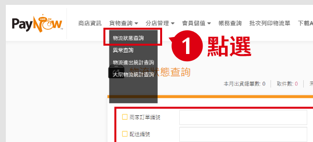

### 2. 依需求輸入尋條件

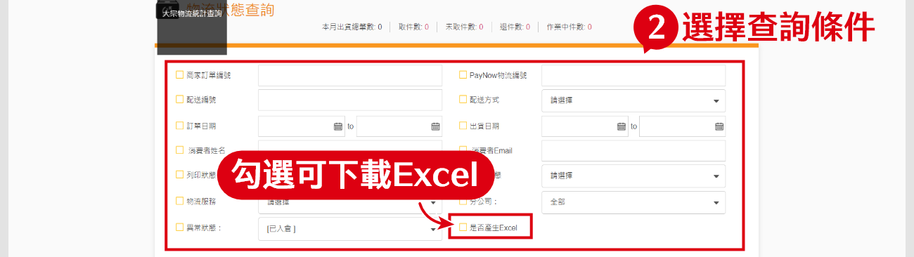

### 3. 點擊「查詢」

### 4. 點擊物流狀態欄的「等待寄件」

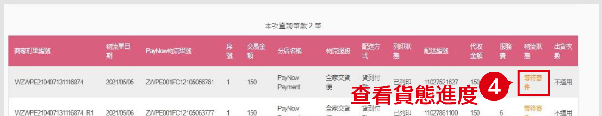

### 5. 開啟物流狀態視窗，可查看貨態進度

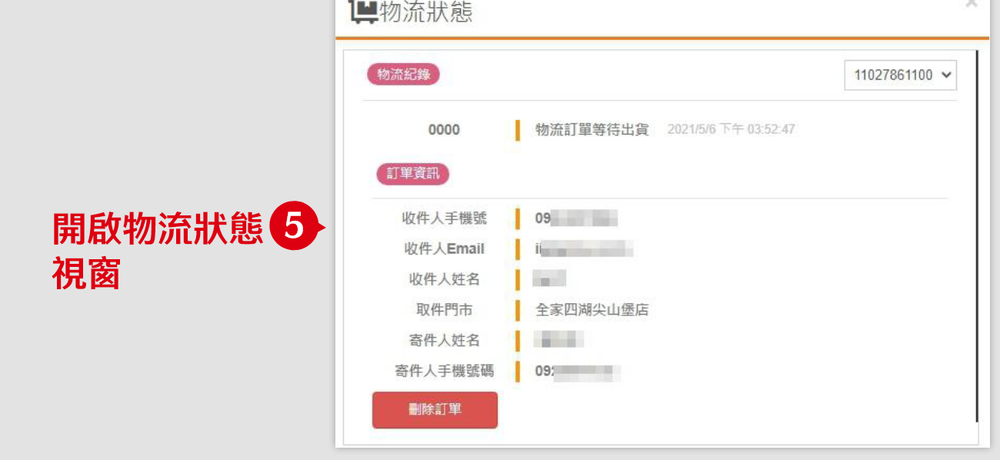

## 如何重新出貨

按照下方步驟。
### 1. 點擊「訂單編號」

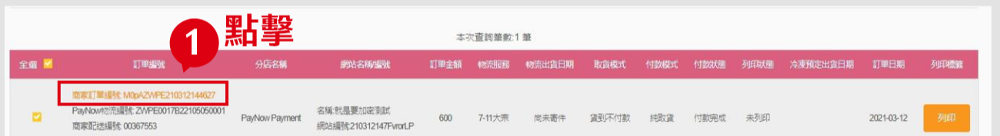

### 2. 顯示詳細資料
如包裹有重新出貨需求，可於此處點選「重新出貨」。

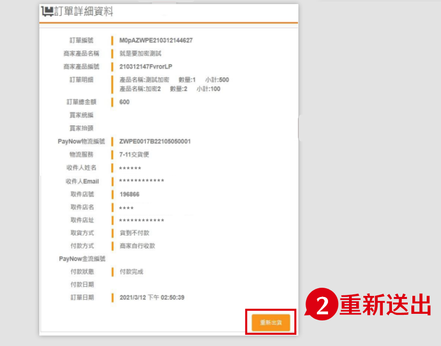

### 3. 系統將會產生新的標籤及配送編號，可列印

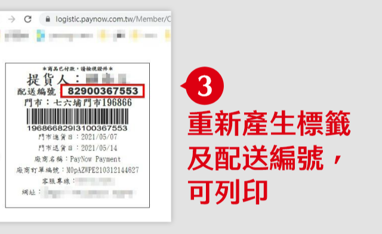

## 如何查詢重新出貨訂單的物流狀態

可分成兩種狀況：
- 大宗物流
- 交貨便物流

### 大宗物流

按照下方步驟：
1. 在「物流狀態查詢」頁面，輸入商家訂單編號
2. 點擊「查詢」
3. 點擊物流狀態欄的內容
4. 在物流狀態頁面，右側下拉選單中可選擇不同梯次出貨的配送編號

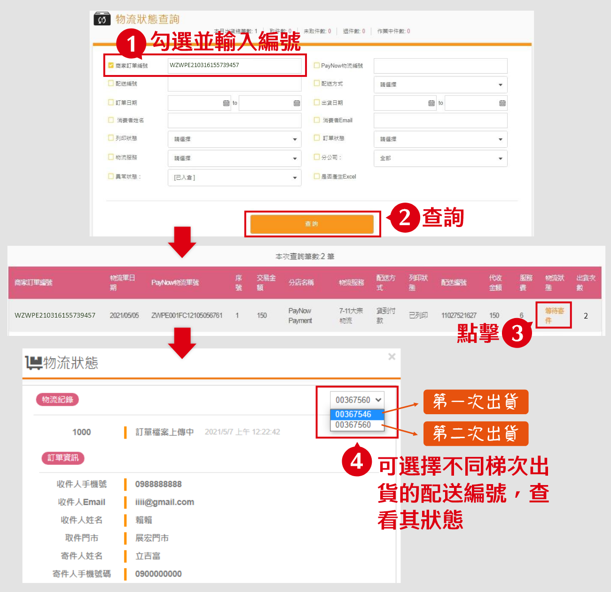

### 交貨便物流

按照下方步驟：
1. 在「物流狀態查詢」頁面，輸入商家訂單編號
2. 點擊「查詢」
3. 點擊物流狀態欄的內容

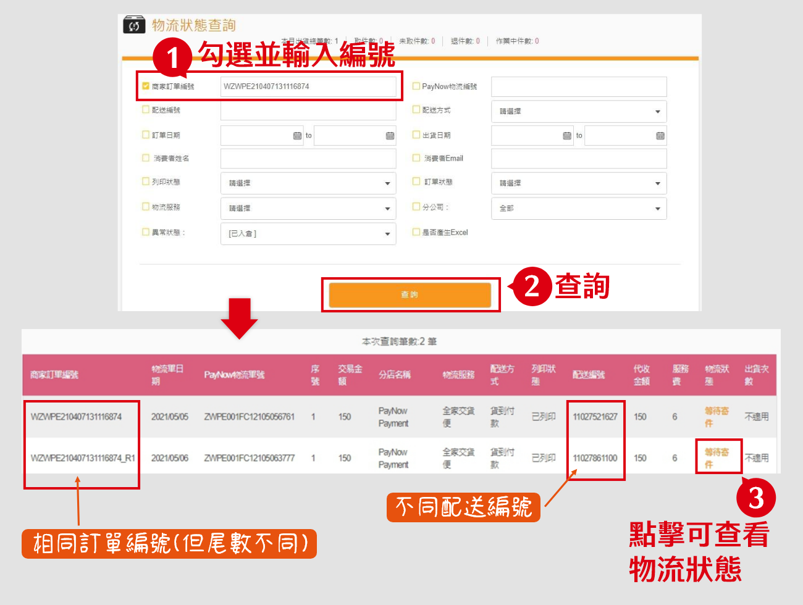
