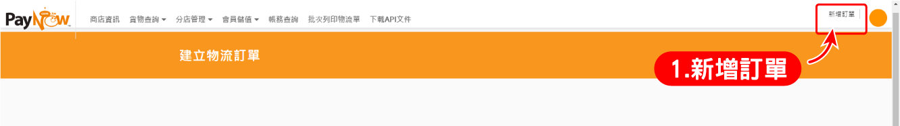
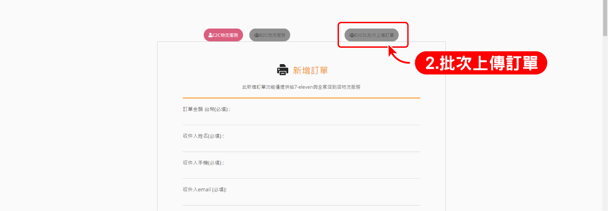
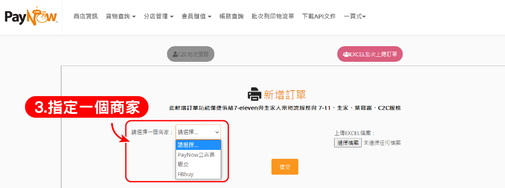
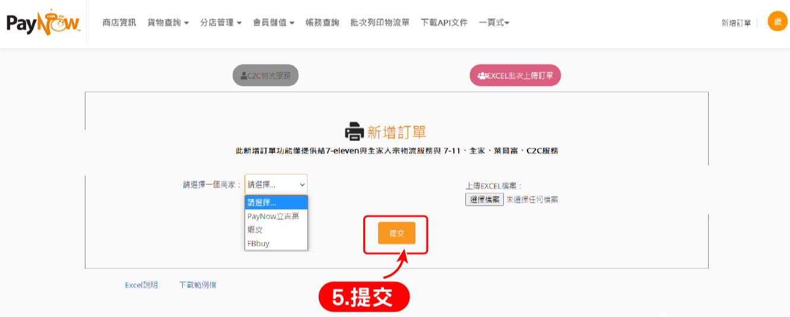
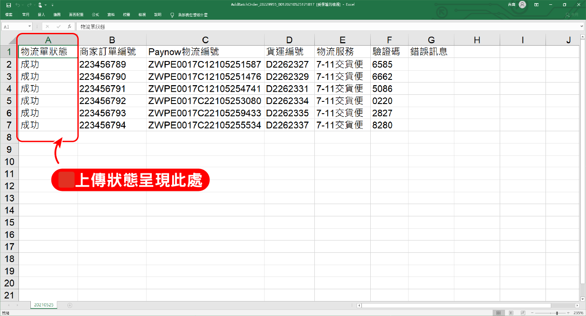
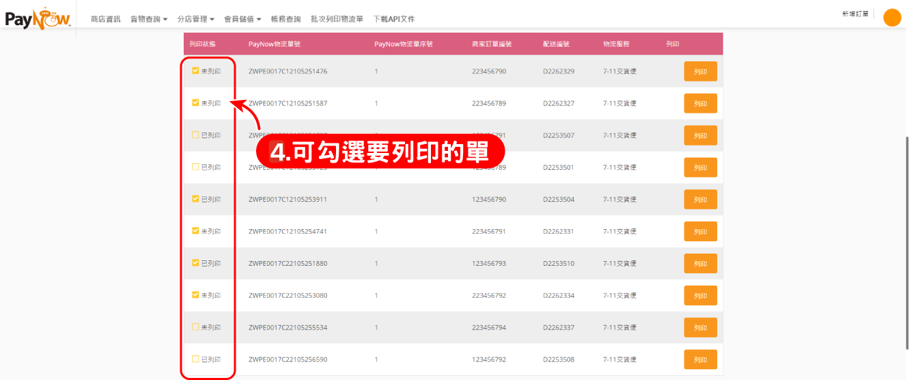
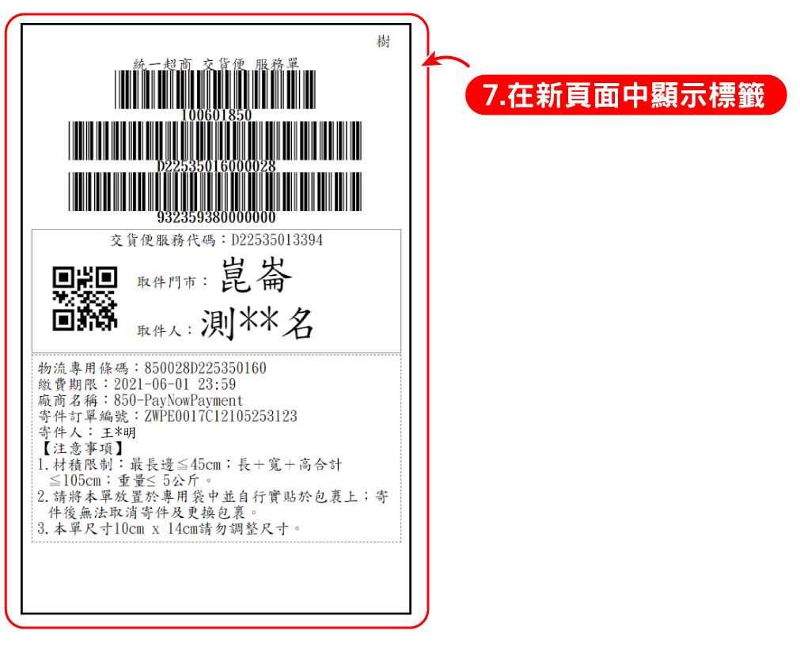
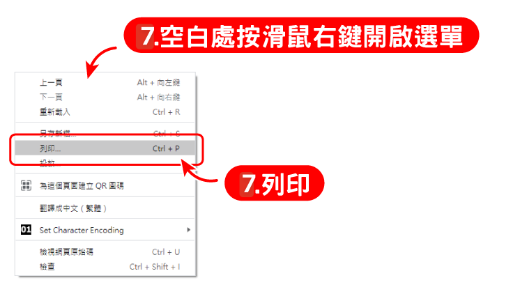

# 批次列印標籤

:::info 摘要
當您使用超商物流寄出商品時，可使用此功能批次列印訂單標籤。
:::

:::caution 前提條件
您已經登入 PayNow 後台系統。
:::

## 如何批次匯入標籤

按照下方步驟。

### 1. 點擊右上方的「新增訂單」

### 2.點擊「EXCLE 批次上傳訂單」按鈕

### 3. 點擊下拉選單，指定一個商家

### 4. 點擊「選擇檔案」，選擇欲上傳的EXCLE 檔案

### 5. 點擊「提交」按鈕，進行上傳

### 6. 查看上傳結果
上傳完畢後，系統會自動下載一份 EXCLE 檔以顯示上傳作業的結果內容。

## 如何批次列印標籤

按照下方步驟。

### 1. 點擊「批次列印物流單」

### 2. 依需求將搜尋條件打勾，並輸入搜尋內容

:::warning 請注意
1. 「物流服務」為必選
2. 只有「7-11交貨便」和「全家交貨便」可以進行列印
:::

### 3. 點擊“查詢”按鈕，查詢的資料將會在下方顯示。

### 4. 在 "物流單資料列表"，左側可複數勾選想要列印的項目

### 5.選擇完成後，點擊「送出」

### 6. 網頁將開啟新的一頁來顯示標籤

### 7. 在空白處按下滑鼠右鍵來開啟選單，點擊「列印」

:::tip 備註
列印的紙張尺寸為 100*150mm
:::