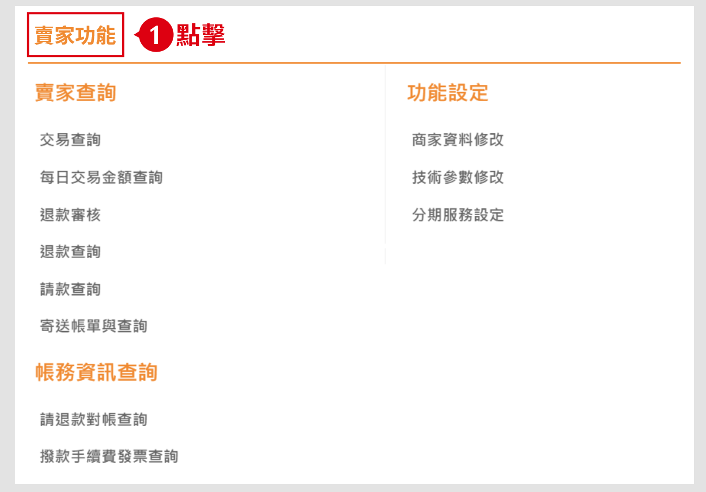
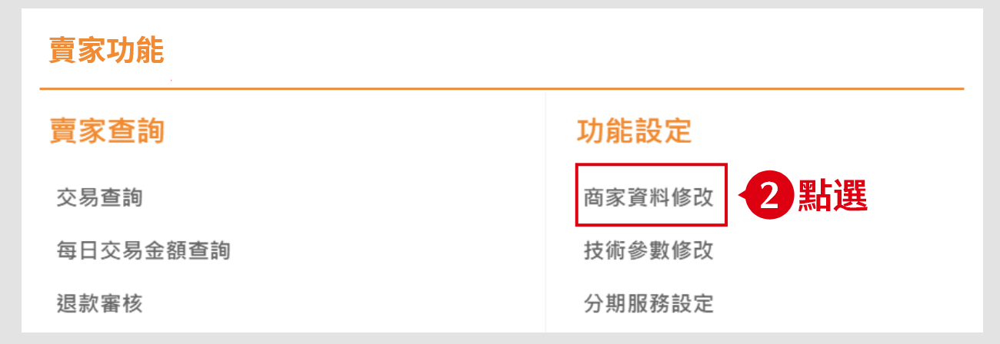
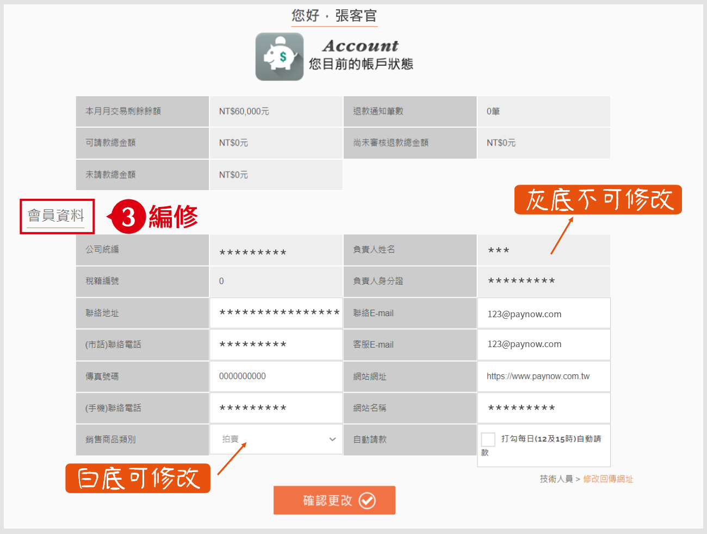
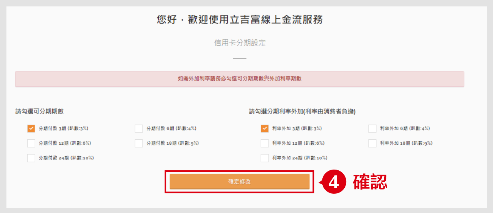
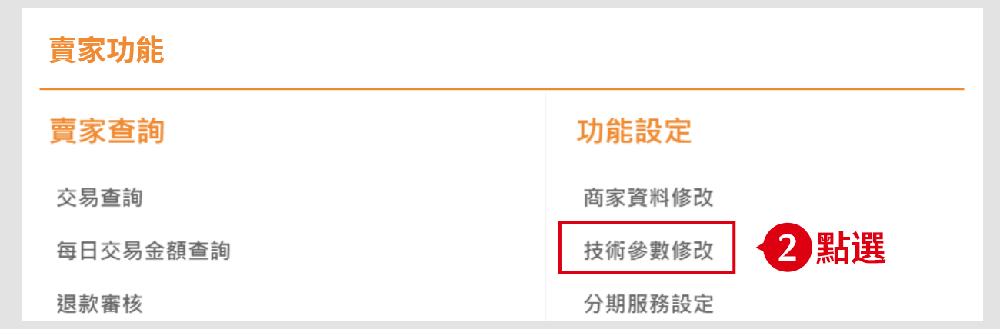
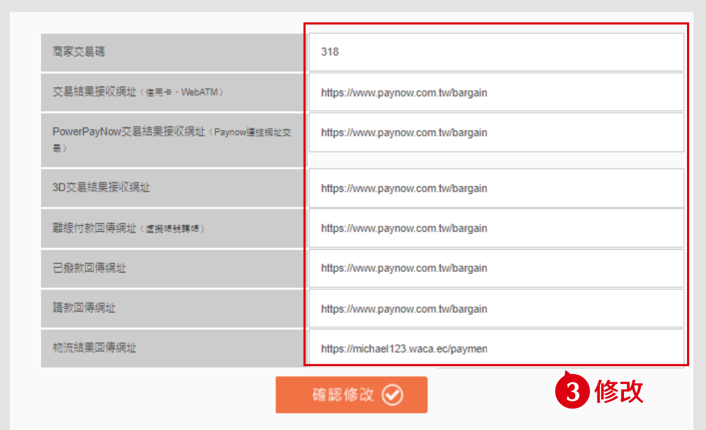
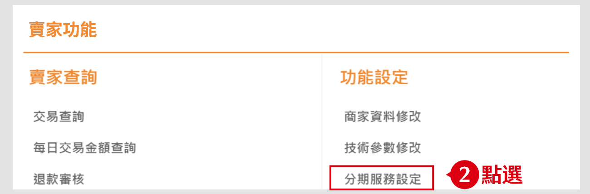

# 資料設定

:::info caution 前提條件
PayNow 提供商店進行商家資料修改、技術參數修改、信用卡分期設定...等交易設定。
:::

:::caution 前提條件
您的身分為「賣家」。
:::

## 如何修改商家資料

按照以下步驟
### 1. 點擊「賣家功能」

### 2. 點擊「商家資料修改」

### 3. 修改資料
白底可自行修改，灰底如有修改需求，請洽PayNow 客服。

### 4. 完成後點擊「確認更改」

## 如何修改技術參數

按照以下步驟
### 1. 點擊「賣家功能」

### 2. 點擊「技術參數修改」

### 3. 修改資料

### 4. 完成後，點擊「確認更改」

## 如何修改信用卡分期設定

按照以下步驟
### 1. 點擊「賣家功能」

### 2. 點擊「分期服務設定」

### 3. 勾選分期方式

### 4. 完成後點擊「確認更改」

