# 賣家功能

:::info 摘要
PayNow 提供商店賣家查詢、請款、退款...等交易操作。
:::

:::caution 前提條件
您的身分為「賣家」。
:::

## 如何查詢交易

按照以下步驟。

### 1. 點擊「賣家功能」

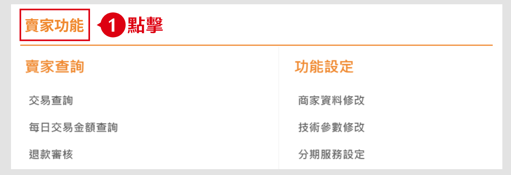

### 2. 點擊「交易查詢」

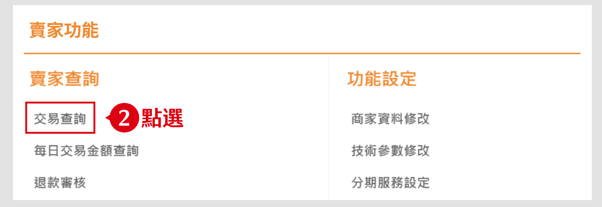

### 3. 輸入查詢條件

例如您的「訂單編號」與「交易日期」。

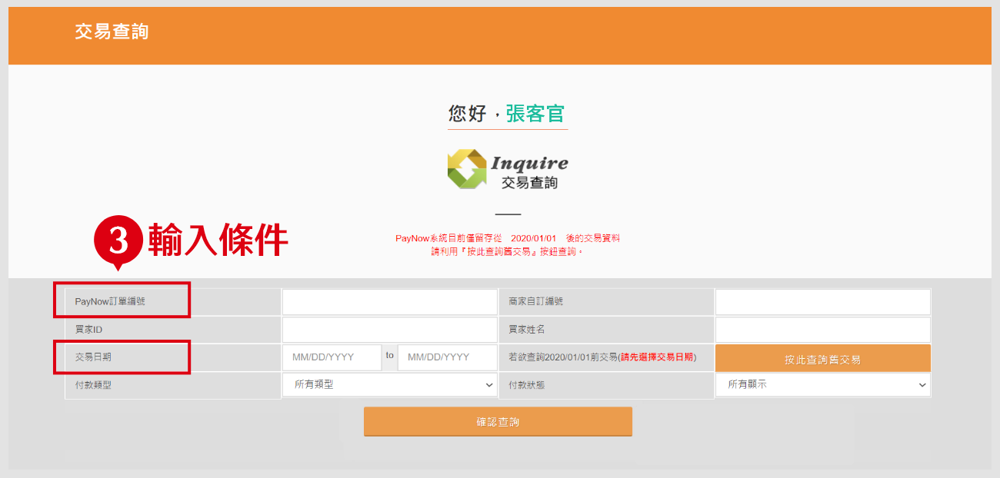

### 4. 點擊「確認查詢」

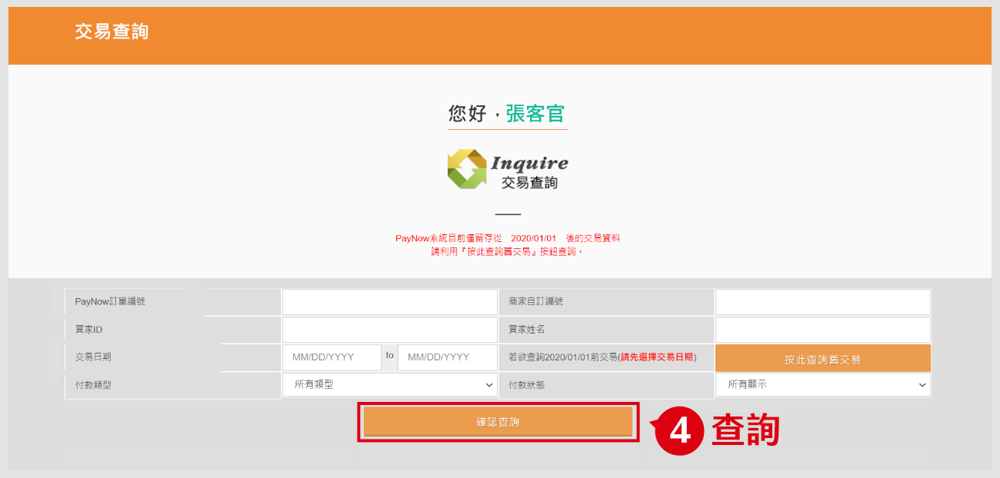

:::tip 備註
1. 若要查看交易詳細資訊，點擊「詳細」(眼睛圖示)。
2. 若要下載交易詳細資訊，可下載 Excel 報表。

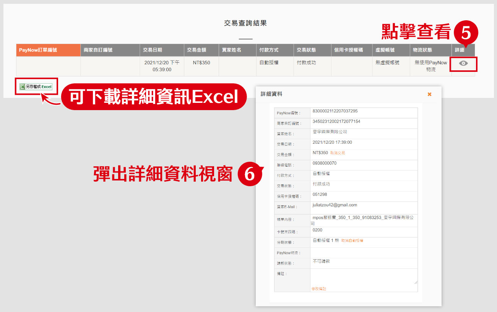
:::

## 如何查詢每日交易

若要快速查詢每日交易，按照以下步驟。

### 1. 點擊「賣家功能」

### 2. 點擊「每日交易金額查詢」

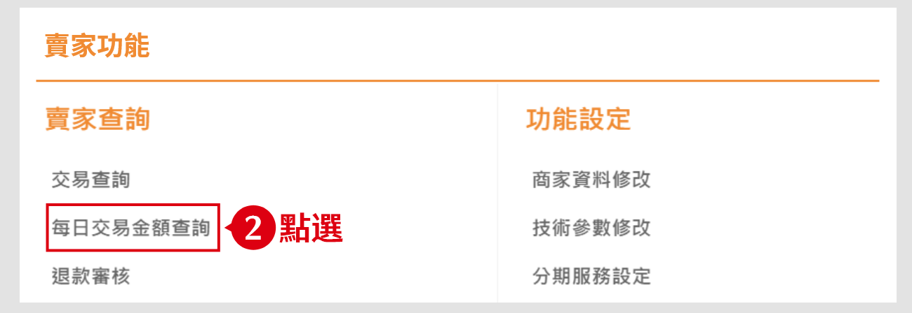

### 3.輸入月份進行查詢

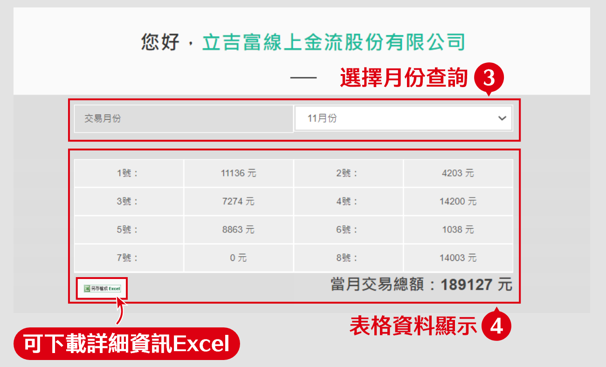

:::tip 備註
若要下載交易詳細資訊，可下載 Excel 報表。
:::

## 如何請款

若要申請請款，按照以下步驟。

### 1. 點擊「賣家功能」

### 2. 點擊「請款查詢」

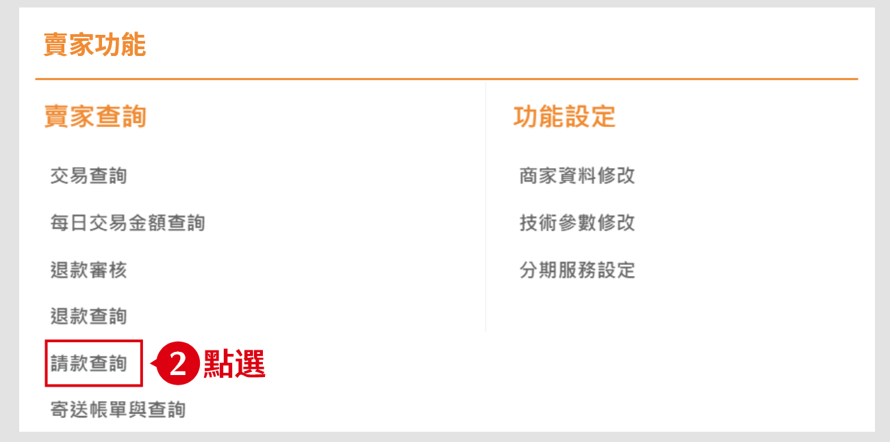

### 3.點擊「可請款」頁籤，並查詢要請款的交易

選擇欄位區間(日期/訂單編號/分店/付款類型)，如不設定條件，系統將自動顯示所有可以請款的訂單。

點擊「查詢」，查詢此區間可以請款的交易。

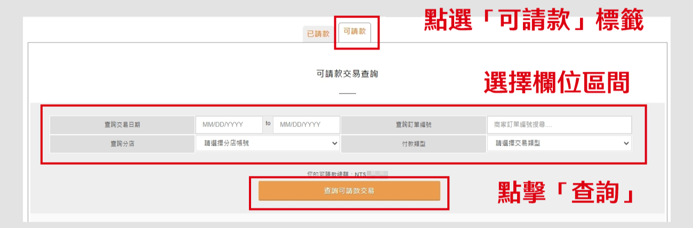

### 4. 選擇請款方式
- **單筆請款：** 點擊「交易請款」欄中的「請款」按鈕
- **全部請款：** 點擊最下方「全部請款」按鈕

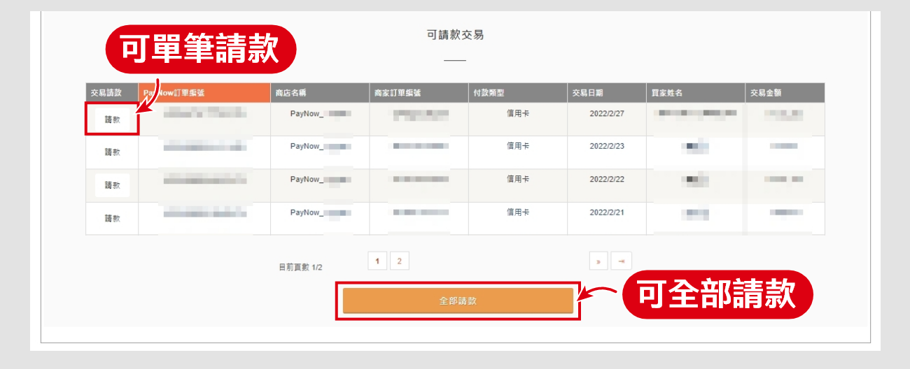

:::tip 備註
1. 請款後2~3工作天會進行撥款，若撥款日遇假日則順延。
2. 若當日請款有錯誤，可於「已請款交易查詢結果」中點擊「取消」。(只有當日的請款可點選請款取消)

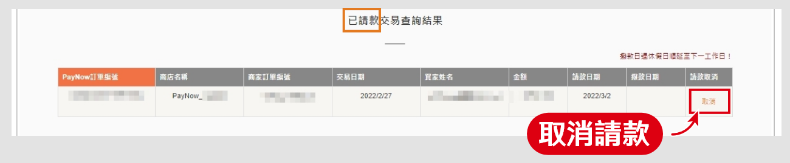
:::

## 如何查詢已請款交易

按照以下步驟：
1.點選「已請款」標籤
2.選擇日期或訂單編號後，可查詢已請款資料
3.下方顯示所查到的資料表

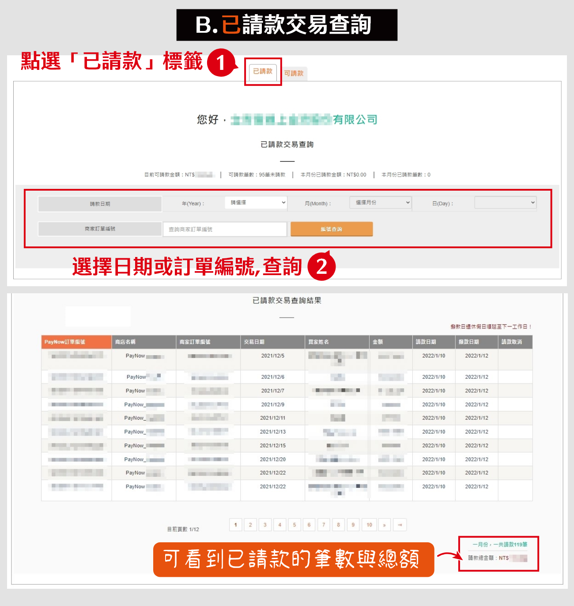

## 如何查詢與退款

按照以下步驟

### 1. 點擊「賣家功能」

### 2. 點擊「交易查詢」

### 3. 輸入查詢條件

例如您的「訂單編號」與「交易日期」。

### 4. 點擊「確認查詢」

若您要退款，請繼續按照下方步驟操作。

### 5. 點擊「詳細」(眼睛圖示)

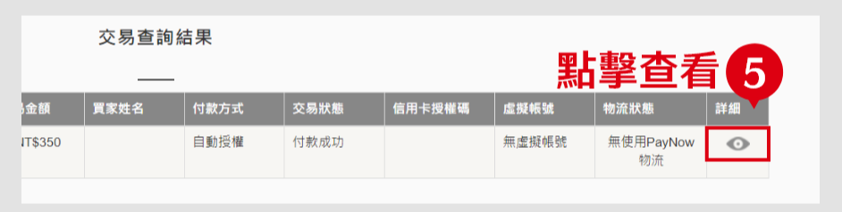

### 6.在詳細資料視窗，可看到此筆資料的交易狀態

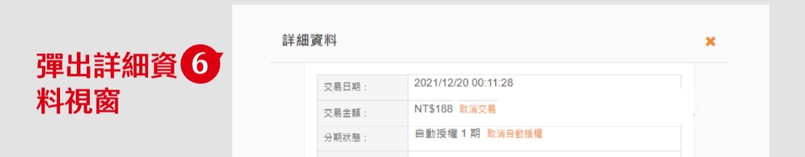

### 7.點擊「交易金額」欄內的「取消交易」

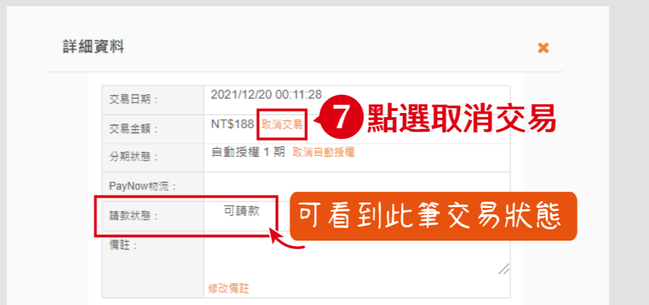

### 8.填寫退款金額
不填寫金額將會全額退款，如需部分退款填寫部分退款金額即可。

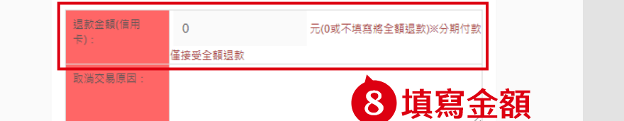

### 9.完成後點擊「確定取消交易」按鈕

## 如何查詢與寄送帳單

按照以下步驟。

### 1. 點擊「賣家功能」

### 2. 點擊「寄送帳單與查詢」

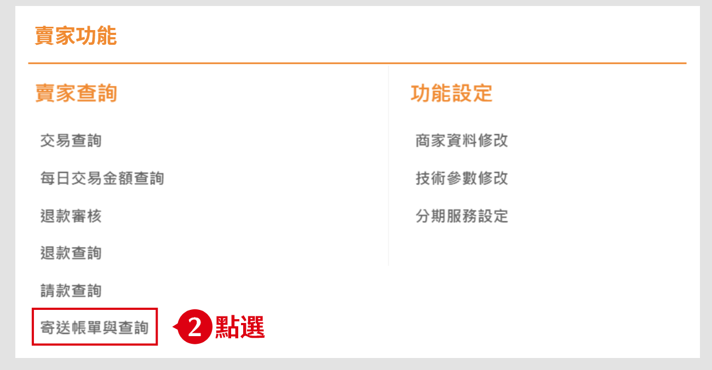

### 3. 選擇帳單提供方式

您可選擇
- 寄送帳單：使用 Email 寄送帳單
- 快速付款連結：產生連結並自行提供

### 3-1. 寄送帳單

按照下方步驟：
1. 點擊「寄送帳單」標籤
2. 填寫資料
3. 點擊寄送帳單 Email

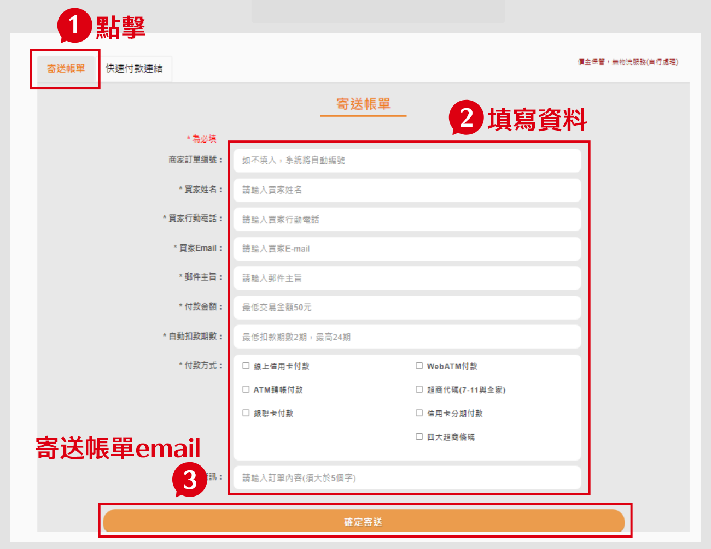

### 3-2. 快速付款連結

按照下方步驟：
1. 點擊「快速付款連結」標籤
2. 填寫資料
3. 點擊「產生連結」
4. 顯示產生的連結
5. 點擊「一鍵複製」可複製連結給

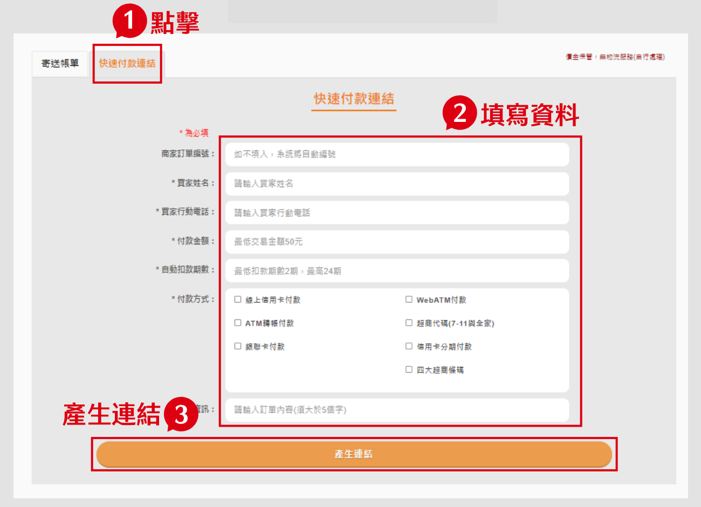