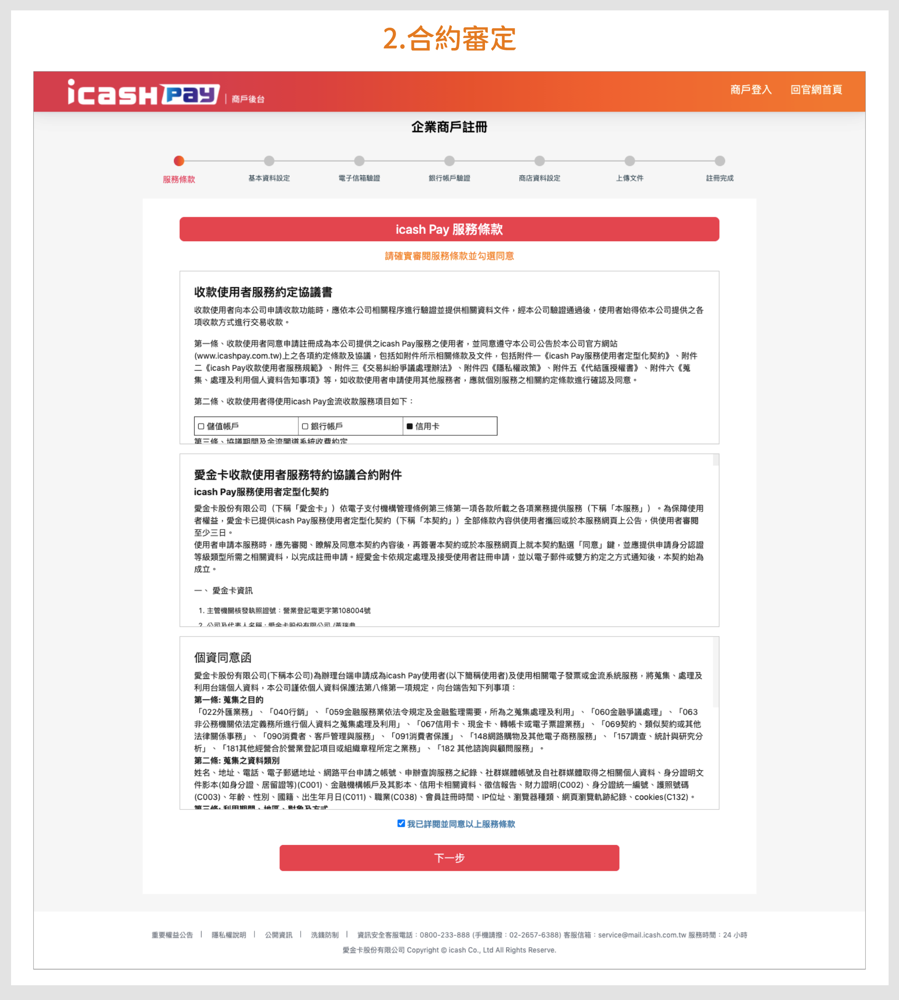
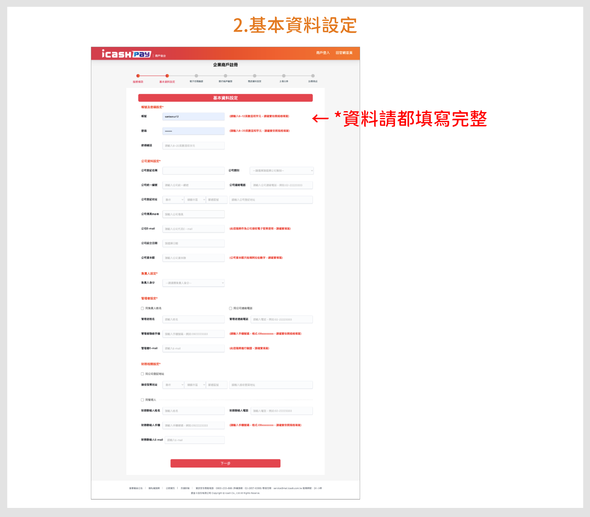
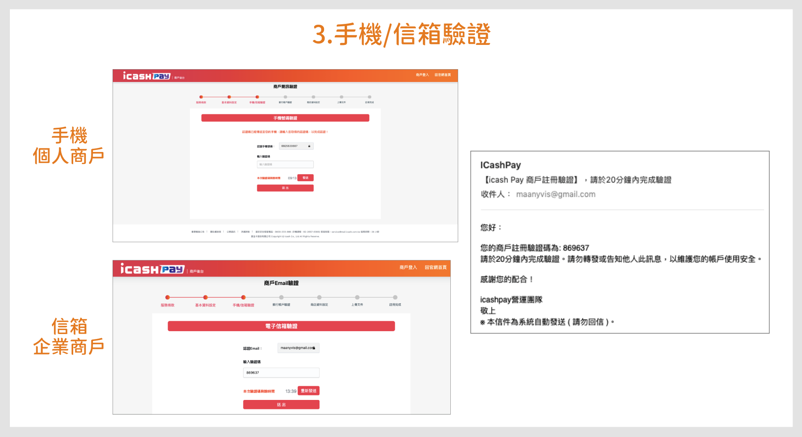
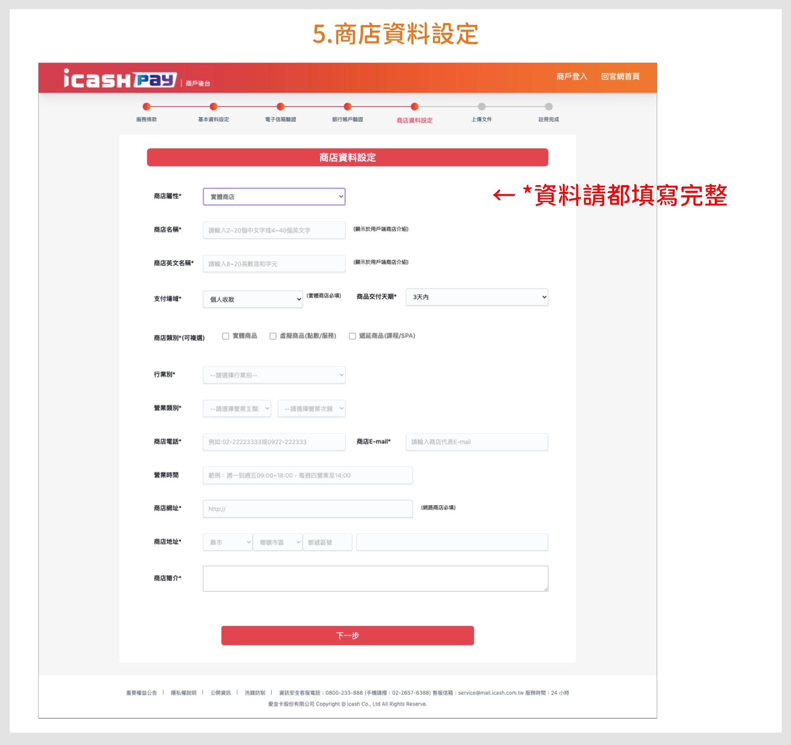
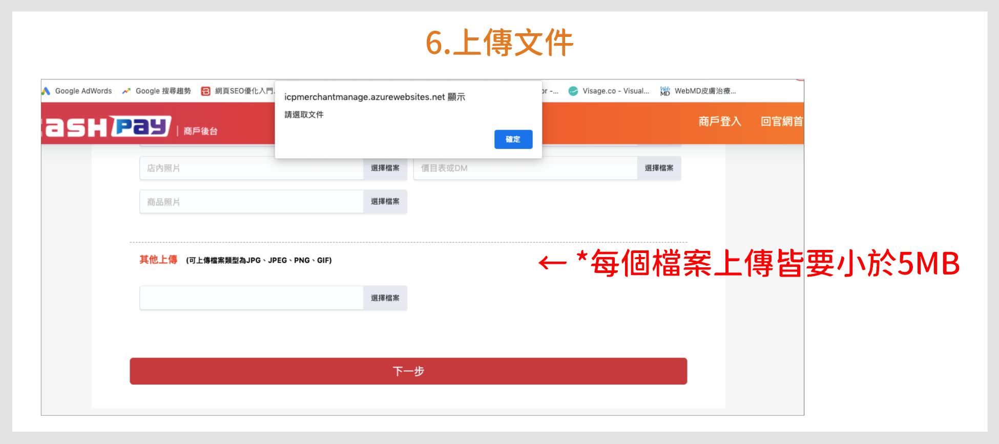
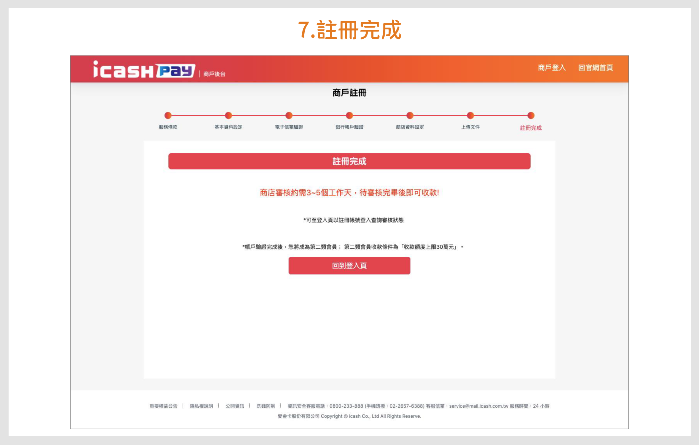
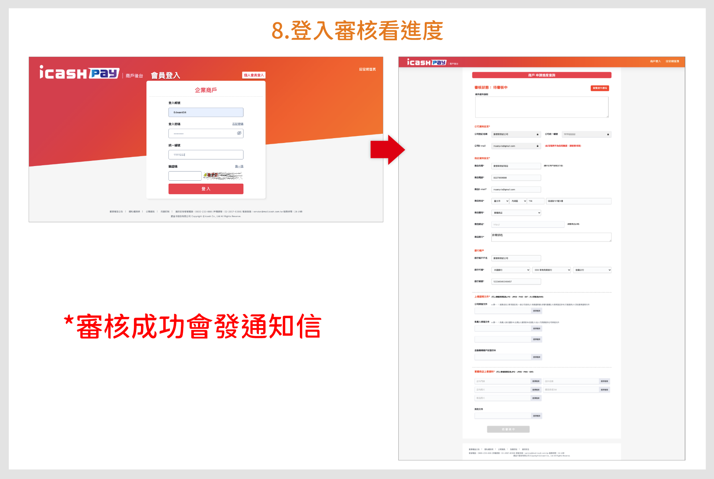

# icash Pay

:::info 摘要
icash Pay是由愛金卡股份有限公司所提供的電子支付服務，新增線上支付、儲值、轉帳與提領等功能。
:::

## 如何使用 PayNow 開通 icash Pay

:::caution 前提條件
註冊前請先備妥需要的資料。

- **個人商戶**
  1. 身分證明文件
  2. 金融機構帳戶(個人存摺)
  3. 實體商店請提供以下照片：(1)店外門牌 (2)店外招牌 (3)店內照片 (4)價目表或DM (5)商品照片
- **企業商戶**
  1. 公司掃描文件：(1)變更(設立)事項登記表 (2)稅籍證明書 (3)商業登記抄本 (4)其他營業證明文件 (以上擇一)
  2. 負責人掃描文件：(1)負責人身分證影本(台灣）(2)護照影本(他國）(3)法人代表請提供公司掃描文件 (以上擇一)
  3. 金融機構帳戶(公司戶存摺，戶名須與註冊的企業名稱相同）
  4. 實體商店請提供以下照片：(1) 店外門牌 (2) 店外招牌 (3) 店內照片 (4) 價目表或DM (5) 商品照片
  5. 如有預付型及遞延性商品需檢附履保或信託相關證明文件
:::

您必須完成以下 8 個步驟：
1. 合約審定
2. 基本資料設定
3. 手機/信箱驗證
4. 銀行帳戶驗證
5. 商店資料設定
6. 上傳文件
7. 註冊完成
8. 等待審核

下方依序說明。

### 1. 合約審定

請閱讀 icash Pay 服務條款，同意服務條款後點擊「下一步」。

### 2. 基本資料設定

填寫完整的基本資料設定。

### 3. 手機/信箱驗證

個人商戶進行手機驗證; 企業商戶進行信箱驗證。

### 4. 銀行帳戶驗證

### 5. 商店資料設定

填寫完整的商店資料設定。

### 6. 上傳文件

上傳商店相關圖片與文件，每個檔案上傳皆要小於 5 MB。

### 7. 註冊完成

商店審核約需要 3~5 個工作天，待審核完畢後即可收款！

### 8. 等待審核

登入後可查看審核進度，審核成功會發通知信。

