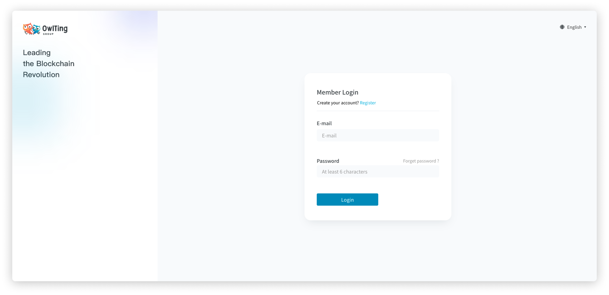
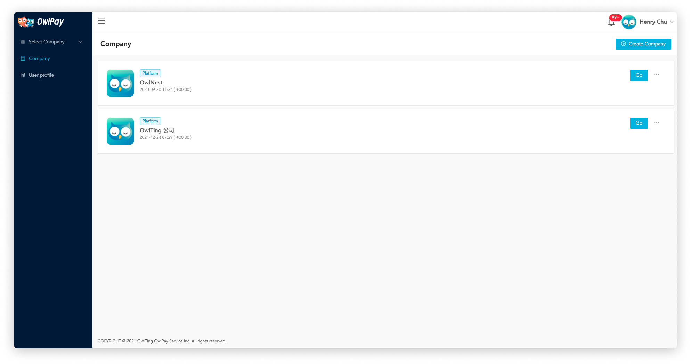
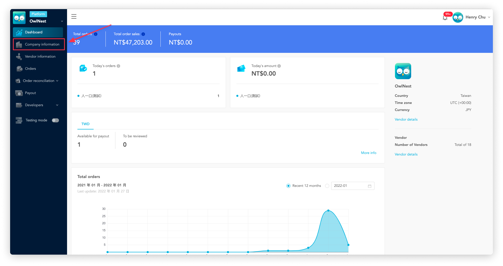
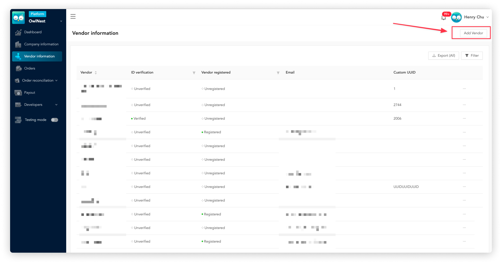
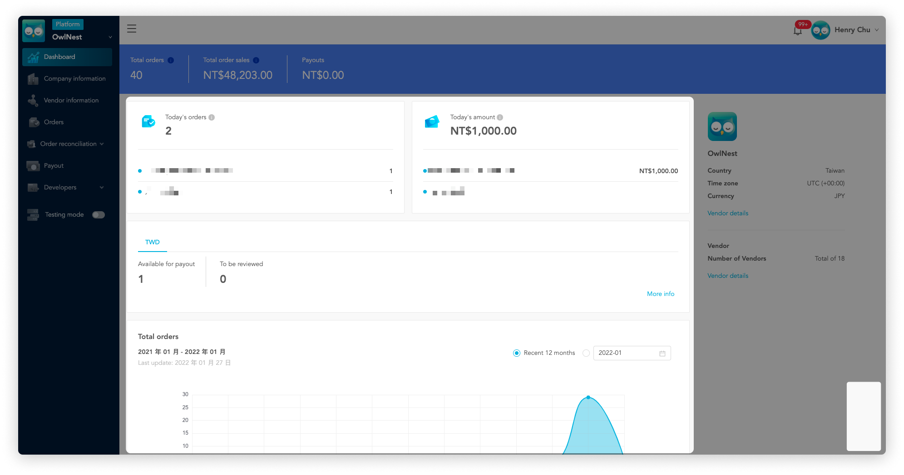
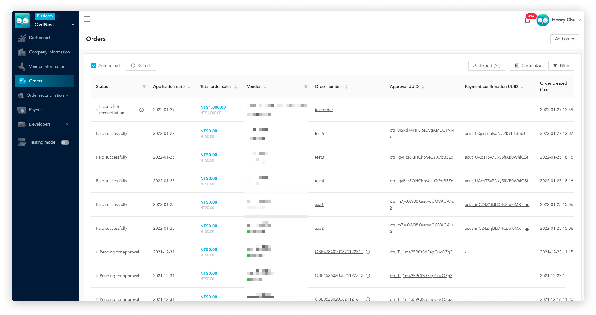
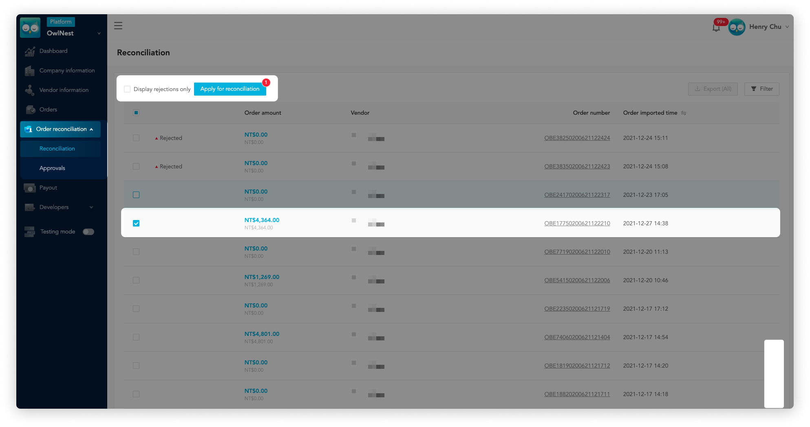
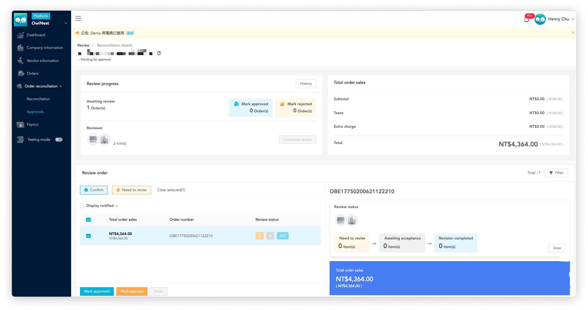
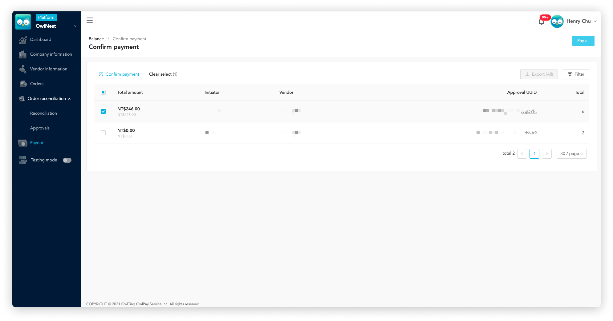

# Start from here | Company

::: tip 💡 Overview
This guide will take you to go through OwlPay services from 0 to 1 . 

Let’s start enjoying automated remittance and cross-border payout services through OwlPay!

☞ **If yor're "vendor", please refer to [Start from here | Vendor](vendor-getting-started.md) for more details.**  
☞ **If you're "developer", please refer to [OwlPay API](../owlpay-api/README.md) to start API Integration.**
:::

::: tip On this page
[[toc]]
:::

## 1. Start to use OwlPay service

### Step 1. Register OwlPay admin Account

To start, you need an OwlPay account. Click [OwlPay login page](https://dashboard.owlpay.com/login) to register a new user account.  

### Step 2. Create your first company on OwlPay admin

After login OwlPay admin, let’s start from [creating your first Company](../page-introduction/company-information.md) on OwlPay.

1. Click "Company" page
2. Click “Create Company” button to create your first company 
3. The newly created company will be displayed on the "Company" page

Now click “ Go“ on right side of your company name.

### Step 3. Complete company information

After entering the company management page, click [Company information](../page-introduction/company-information.md)  to complete your company’s information. OwlPay team will review your company information to activate full functions! 

To fit in your company’s payment operations, you can manage company's user accounts and set different permissions here. Different  to facilitate your subsequent payment processing operations.

### Step 4. Add Vendor

When you first enter the company management page, you will find that the [Dashboard](../page-introduction/dashboard.md)  is empty. Don't worry, it's because your company has no order information yet. 

Please click [Vendor](../term-definition/vendor.md) to add new vendor into your company. When the vendors’ order are imported to OwlPay, order information will appear on the dashboard.

### Step 5. Manage order

When a new order is created, you can transfer order information to OwlPay through your system or manually create an order. [Dashboard](../page-introduction/dashboard.md)  gives you a quick overview of your company's revenue information and charts of recent order growth. 

Want to check order details ? You can see these information on [Order](../page-introduction/order) page.

### Step 6. Apply for order reconciliation

If you are ready to transfer money to vendors, click [Reconciliation](../page-introduction/reconciliation.md) to to start the reconciliation process (For more details, please refer to [OwlPay Payout Process](./../term-definition/owlpay-payout-flow.md)).

### Step 7. Review order reconciliation request

When you submit an order for reconciliation, the person responsible for reviewing can view the order details on [Review](../page-introduction/review.md) page and approve/reject the application.

### Step 8. Make payout to vendors

If the request is approved, you can set up the order(s) payout on [Payout](../page-introduction/payout.md) page. OwlPay will make payouts on the specified date for you.

## 2. Related Links
- [OwlPay | Disrupting B2B Payments Using Blockchain Tech](https://owlpay.com/?lang=en)
- [Developer API Document](http://owlpay-external-doc.s3-website-ap-northeast-1.amazonaws.com/#core-resources-order-create-a-order)