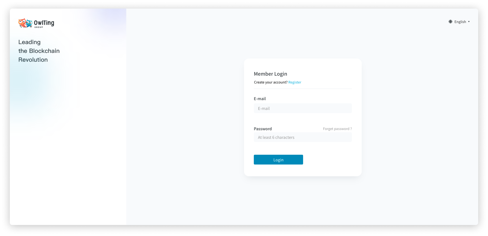
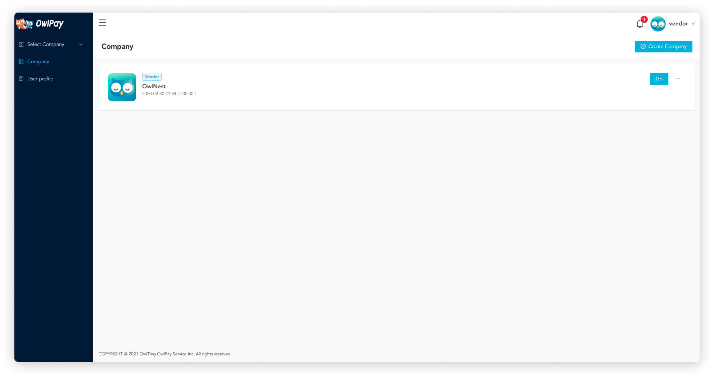
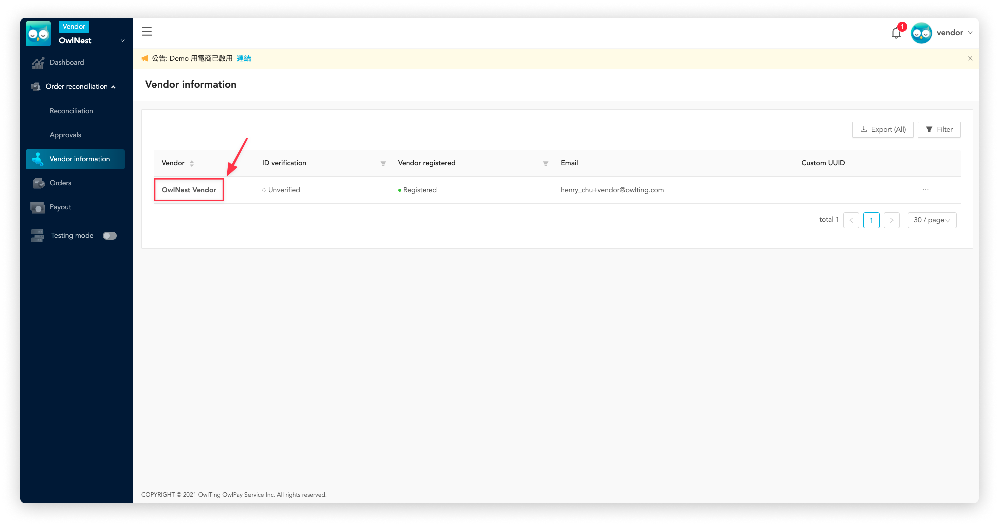
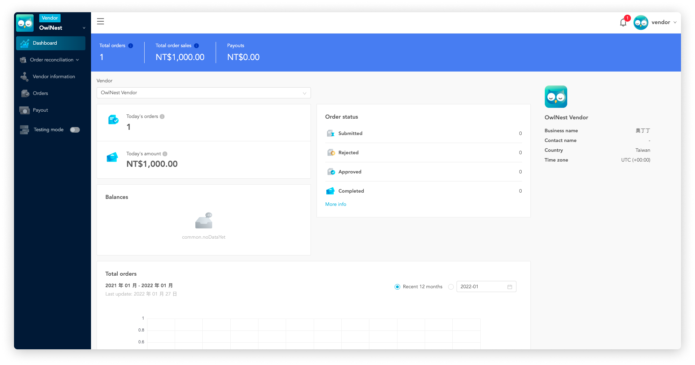
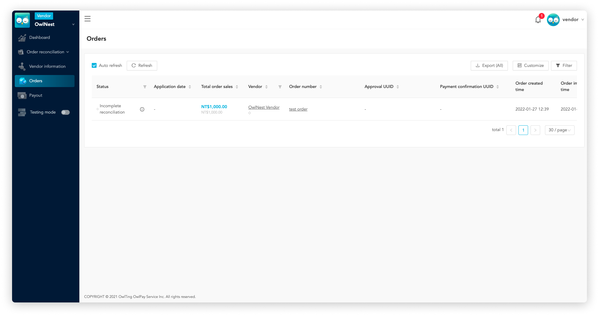
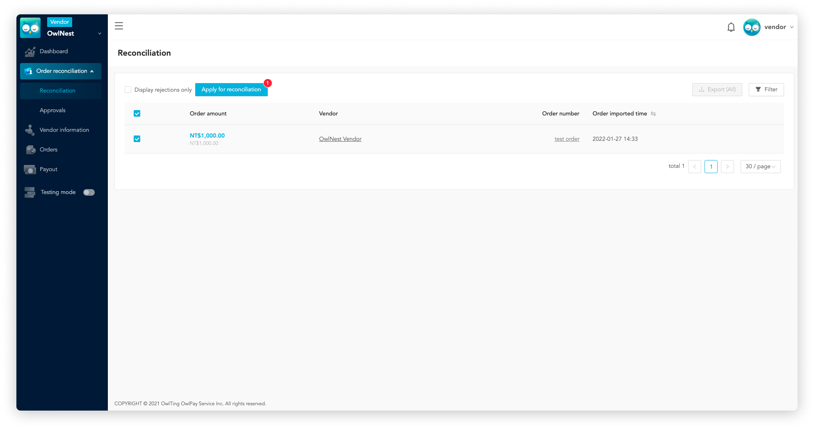
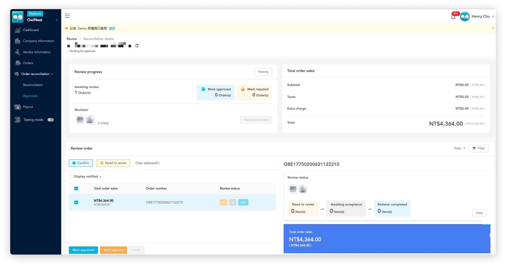
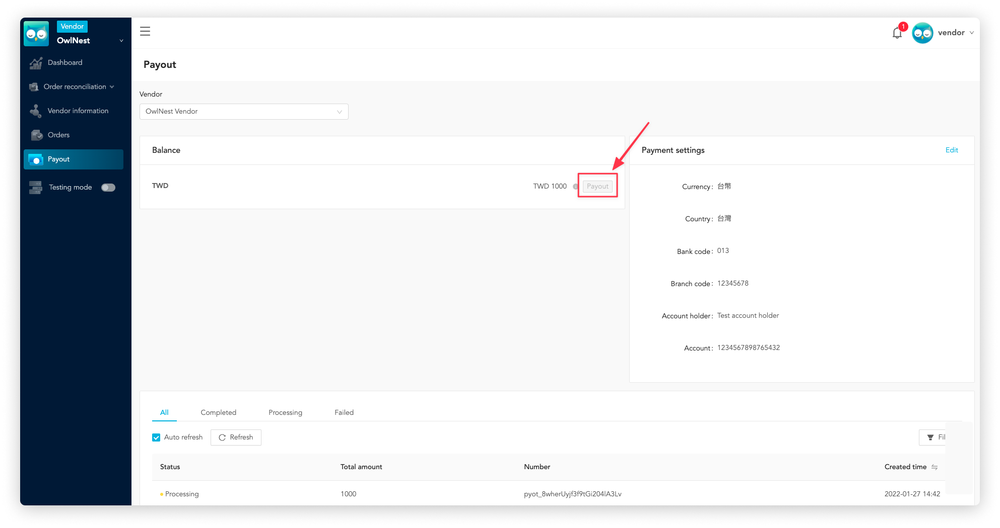

# Start from here | Vendor

::: tip 💡 Overview

If you are invited by other company to use OwlPay (as "vendor"), the following document will take you from 0 to 1 to understand Owlpay service and start to withdraw money from company with OwlPay!

☞ **If you're "company", please refer to [Start from here | company](README.md) for more details.**  
☞ **If you're "developer", please refer to [OwlPay API](../owlpay-api/README.md) to start API Integration.**
:::

::: tip On this page
[[toc]]
:::

## 1. Start to sue OwlPay service

### Step 1. Register OwlPay account

To start, you need an OwlPay account. Click [OwlPay login page](https://dashboard.owlpay.com/login) to register a new user account.

### Step 2. Go to the company dashboard

After you login OwlPay, please follow below steps to enter company to check your orders.
1. Click "Company" page
2. Find the company that invited you to join and click "Go".

### Step 3. Complete vendor information

After entering the company page, click [Vendor information](../page-introduction/vendor-information.md) to browse your information on OwlPay. In order to activate your account's full functions on OwlPay, click your vendor name on this page and complete information. OwlPay team will review your information to enable full account functionality!

### Step 4. Manage orders

When there are new orders created, you can view the [Dashboard](../page-introduction/dashboard.md) to have a quick overview of your company's revenue status and recent order growth.

Want to check order details? You can view the order details via [Order](../page-introduction/order.md) page.

### Step 5. Apply for order reconciliation

If you are ready to request a payment from the company, please click [Reconciliation](../page-introduction/reconciliation.md) to start the reconciliation process (For more details, please refer to [OwlPay Payout Process](./../term-definition/owlpay-payout-flow.md)).

### Step 6. Review order reconciliation request

When you submit an order for reconciliation, the person responsible for reviewing can view the order details on [Review](../page-introduction/review.md) page and approve/reject the application.

### Step 7. Start withdrawal and wait for company payout

If the reconciliation order request is approved, you can start withdrawal by clicking "Payout" button on [Payout](../page-introduction/payout.md) page.

Upon receiving your request, the company will specify a date to pay you.

## 2. Related Links

- [OwlPay | Disrupting B2B Payments Using Blockchain Tech](https://owlpay.com/?lang=en)
