# 查詢作業

::: tip 💡 摘要
當您 [開立發票](./generation.md) 給買家後，可以在 PayNow 後台查詢發票作業的細節。
:::

::: tip 在此頁面中，你可以了解：
[[toc]]
:::

## 如何查詢發票

按照以下步驟：
### 1. 點擊「查詢作業」>「查詢發票」

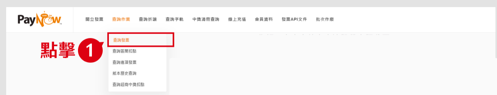

### 2. 填寫資料

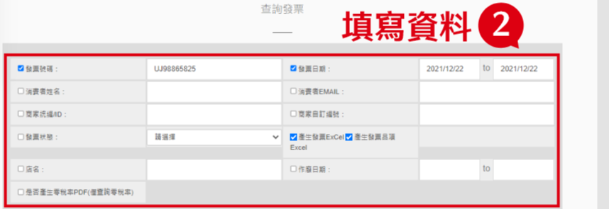

### 3. 點擊「確認查詢」

系統將依查詢條件顯示查詢結果。

:::tip 備註
每 200 筆查詢結果將合成 1 個檔案。

點擊「送出」即可下載、列印發票收執聯。

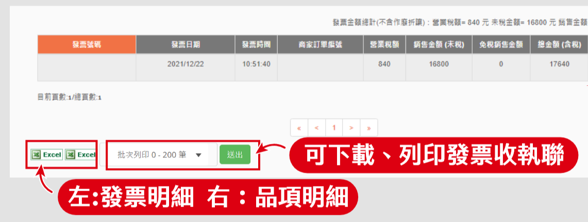
:::

## 如何操作發票功能

PayNow 提供您對發票進行以下操作
- **列印收執聯：** 列印電子發票明細。
- **補寄發票：** 填寫Email，補寄發票開立通知。
- **補寄簡訊：** 填寫手機號碼，補寄發票開立通知。
- **寄送紙本：** 填寫消費者地址及姓名，申請紙本發票寄送。
- **發票折讓：** 勾選品項，輸入折讓金額，確定折讓。
- **發票作廢：** 按下「作廢」按紐，作廢完成。

按照以下步驟：

### 1. 查詢欲操作的發票

參考 [如何查詢發票](#如何查詢發票)，查詢到欲操作的發票。

### 2. 點擊詳細資訊欄裡的「眼睛」圖示

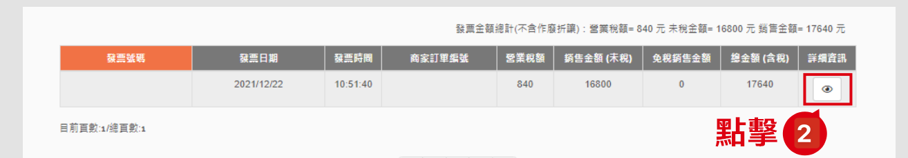

### 3. 在顯示詳細資訊視窗中，點擊欲操作的功能

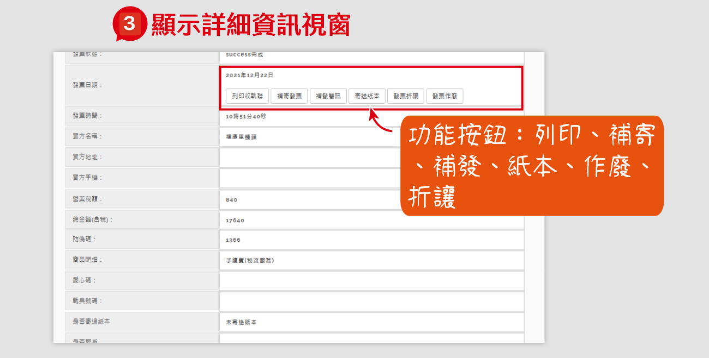

## 如何查詢區間扣點

<!-- @TODO 區間扣點是什麼 -->

按照以下步驟：
1. 點擊「查詢作業」>「查詢區間扣點」
2. 設定查詢的區間
3. 點擊「確定」
4. 查詢結果列表顯示於下方

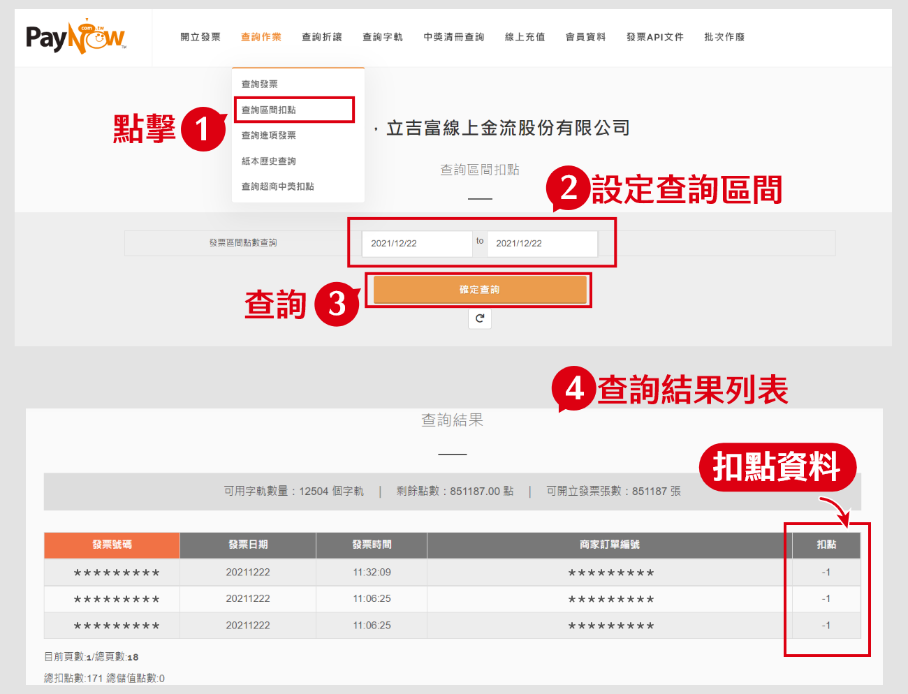

## 如何查詢進項發票

:::tip 💡 摘要
進項發票指公司購買營業所需物品或勞務時，所取得的發票。

您可透過 PayNow 後台查詢進項發票。
:::

:::tip ❗ 前提條件
您的賣方需為 PayNow 電子發票商家，發票開立後可在此查詢到進項發票。
:::

按照以下步驟：
### 1. 點擊「查詢作業」>「查詢進項發票」

### 2. 填寫資料

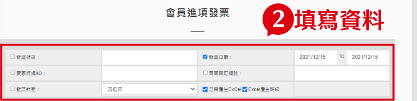

### 3. 點擊「確認查詢」

查詢結果列表顯示於下方。

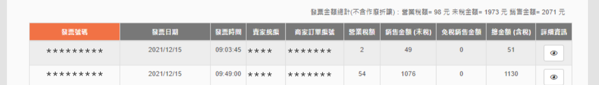

## 如何查詢已開立的發票

按照以下步驟：
1. 點擊「查詢作業」>「紙本歷史查詢」
2. 填寫資料
3. 點擊「確認查詢」
4. 查詢結果列表顯示於下方

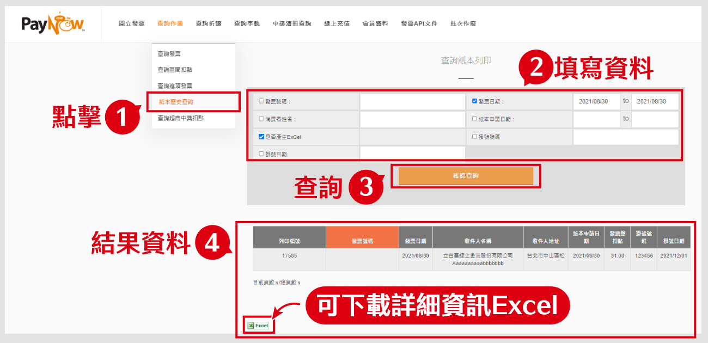

## 如何查詢超商中獎扣點

按照以下步驟：
1. 點擊「查詢作業」>「查詢超商中獎扣點」
2. 設定查詢的區間
3. 點擊「確認查詢」
4. 查詢結果列表顯示於下方

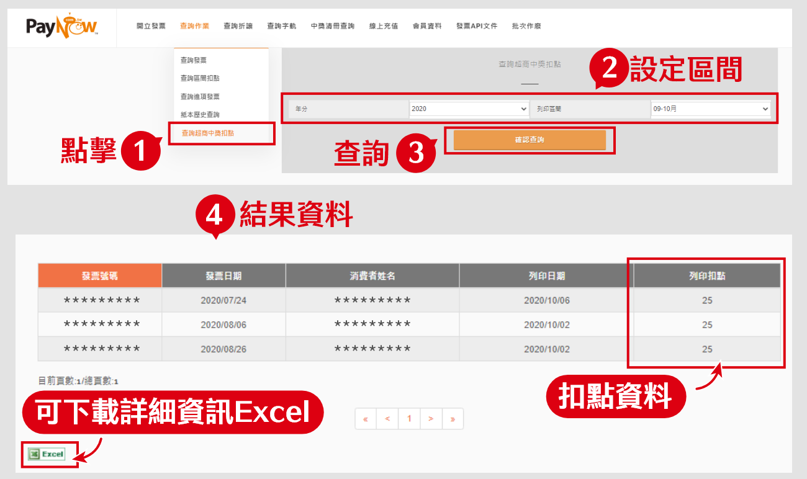

## 如何查詢發票折讓單

按照以下步驟：
1. 點擊「查詢折讓」
2. 填寫資料
3. 點擊「確認查詢」
4. 查詢結果列表顯示於下方

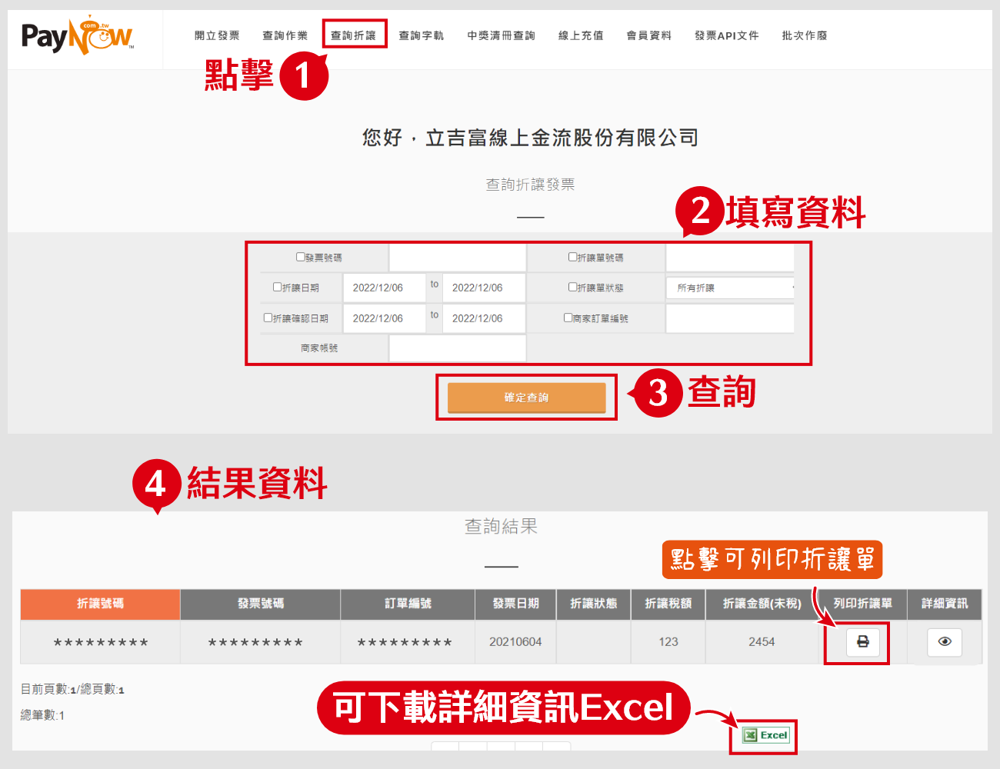

## 如何補發或取消折讓單

### 1. 查詢欲操作的折讓發票

參考 [如何查詢發票折讓單](#如何查詢發票折讓單)，查詢到欲操作的發票折讓單。

### 2. 點擊詳細資訊欄裡的「眼睛」圖示

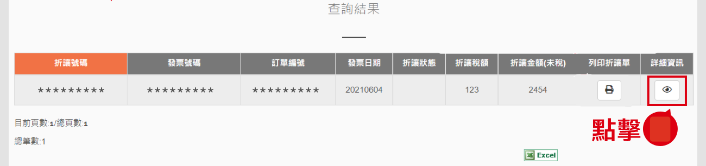

### 3. 在顯示詳細資訊視窗中，點擊「取消折讓單」或「補發折讓單」

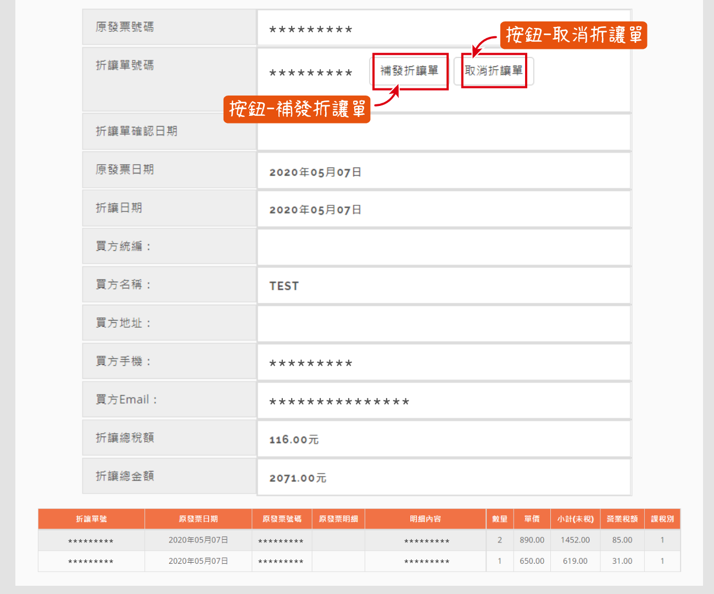

## 如何查詢中獎清冊

按照以下步驟：
1. 點選「中獎清冊查詢」
2. 設定查詢的區間
3. 點擊「查詢中獎發票」

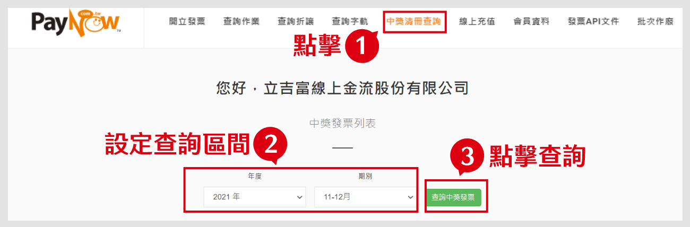