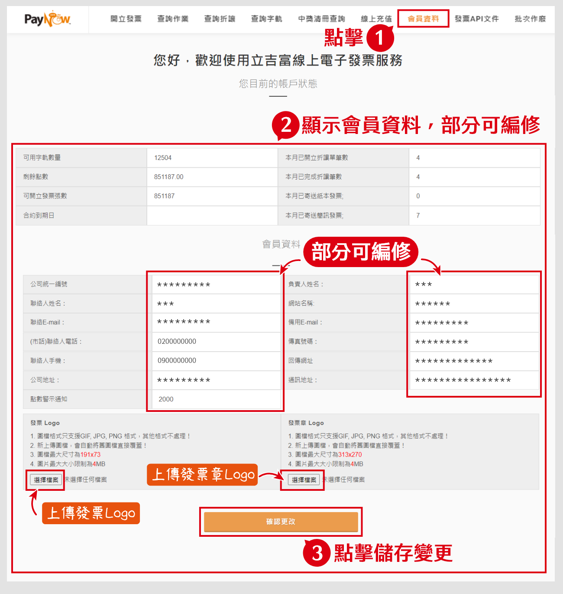
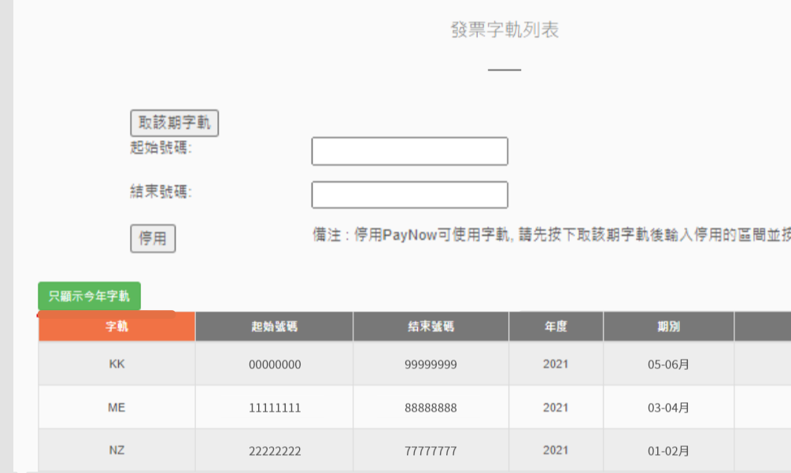
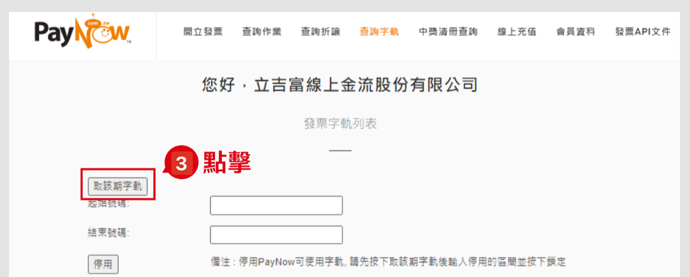
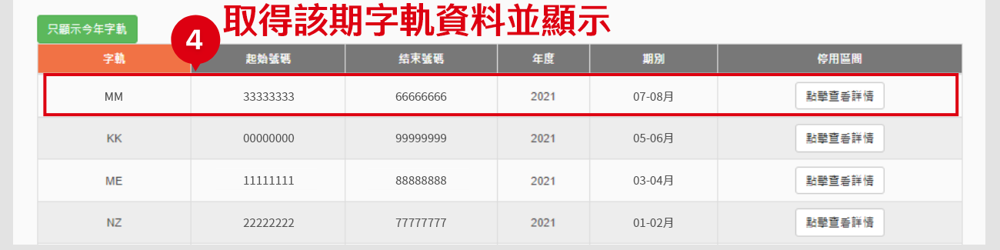
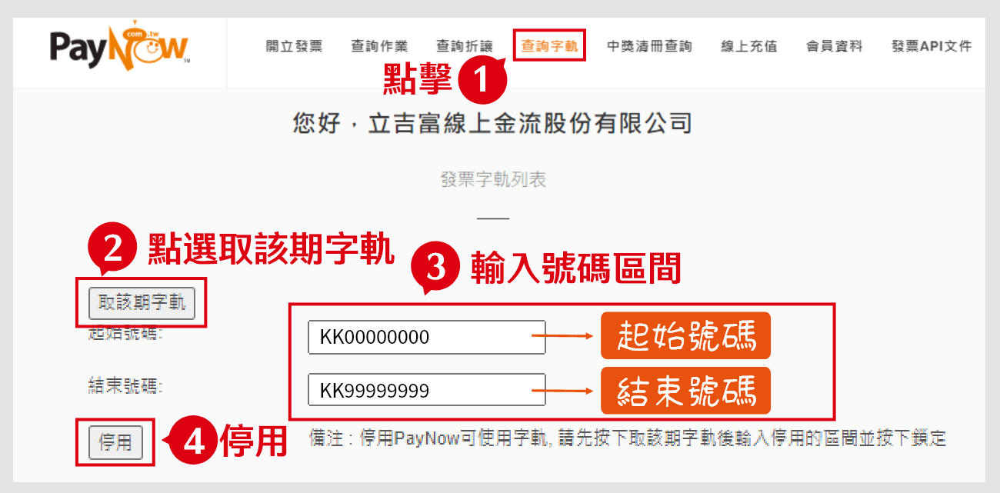
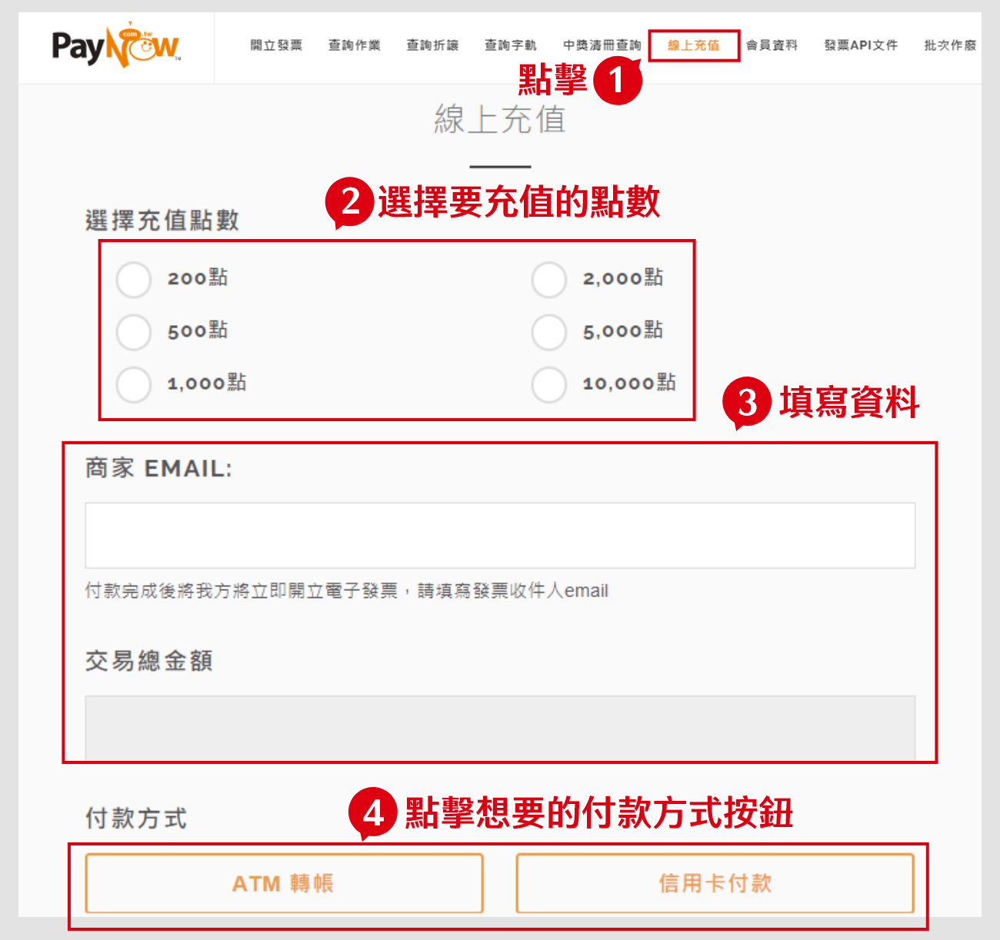
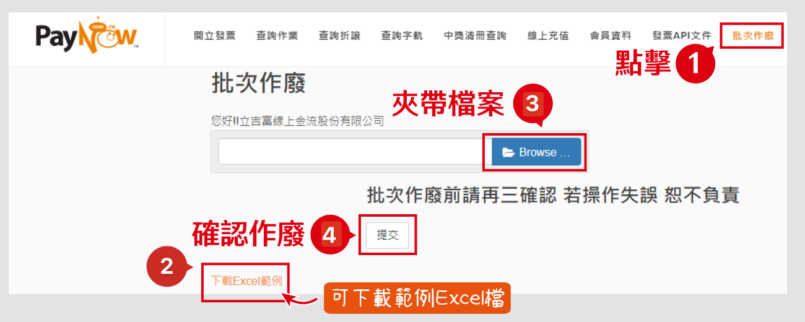

# 功能操作

::: tip 💡 摘要
您可以在 PayNow 後台修改發票開立的相關設定。
:::

::: tip 在此頁面中，你可以了解：
[[toc]]
:::

## 如何查詢或修改會員資料

按照以下步驟
1. 點擊「會員資料」
2. 頁面顯示會員資料表，部分可編修。
3. 若有修改，請點擊「確定更改」儲存變更。

:::備註
無法直接編輯的資料（如：公司地址），請聯繫 PayNow 客服處理。
:::

## 如何查詢發票字軌

按照以下步驟。
### 1. 點擊「查詢字軌」

### 2. 資料顯示於下方

## 如何取得當期字軌

商家當期開立第一張發票時，PayNow 系統即會自動取用字軌顯示。

按照下方步驟。

### 1. 點擊「查詢字軌」

### 2. 資料顯示於下方

點擊左側綠色按鈕，顯示今年字軌。

若當期尚未開立發票的話，可繼續以下操作。

### 3. 點擊「取該期字軌」

### 4. 該期字軌會顯示於資料表中

## 如何停用字軌

按照以下步驟：
1. 點擊「查詢字軌」
2. 點擊「選取該期字軌」(如當期已開立第一筆發票，可省略此步驟)。
3. 在輸入欄中，輸入停用的起始號碼與結束號碼
4. 點擊「停用」

:::tip 請注意
已停用的字軌號碼，PayNow 系統將以空白字軌上傳。

若您有在其他平台使用發票字軌，請於當期報稅前至「財政部電子發票服務平台」上手動修改空白字軌區間。
:::

## 如何線上充值

按照以下步驟：
1. 點擊「線上充值」
2. 選擇要充值的點數
3. 填寫資料
4. 點擊想要的付款方式

<!-- @TODO 線上充值是用在哪裡 -->

## 如何批次作廢

按照下方步驟：
1. 點擊「批次作廢」
2. 點擊「下載範例 Excel 檔」下載範本，並按照範本資料填寫
3. 點擊「Browse」上傳檔案
4. 點擊「提交」確認作廢

:::warning 請注意
一個 Excel 檔案最多可上傳 200 筆發票，如超過請分批上傳。
:::