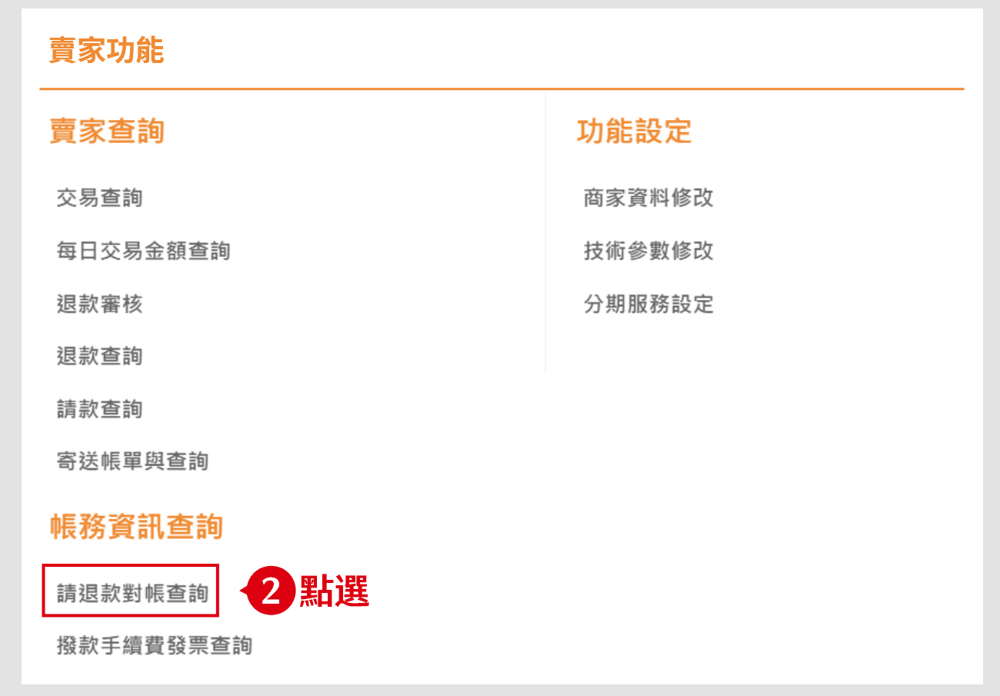
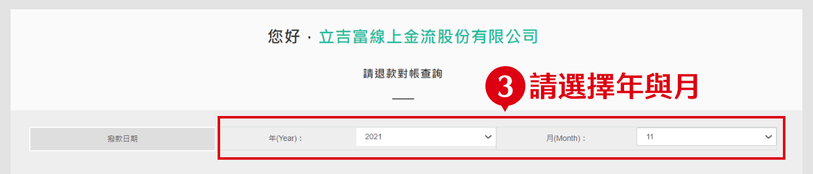
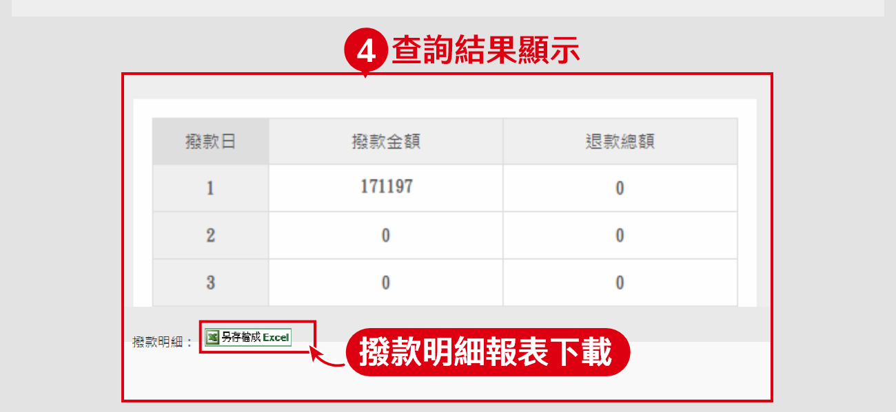
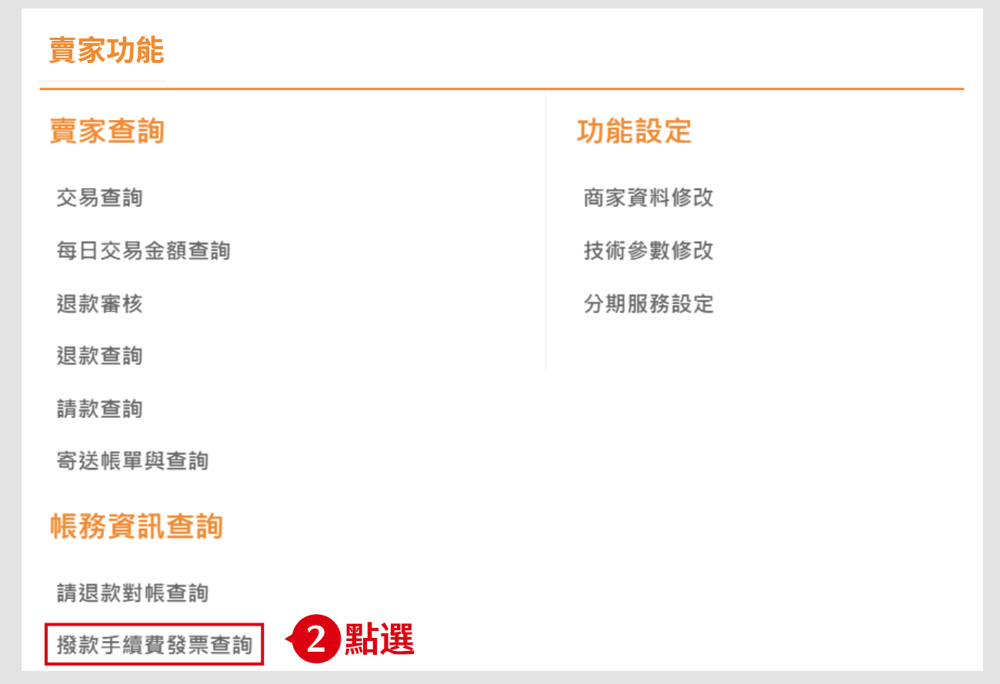
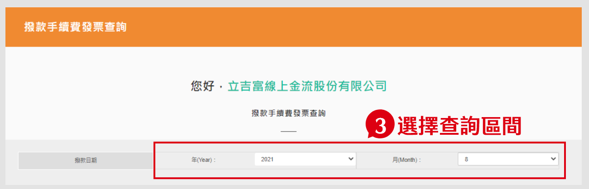
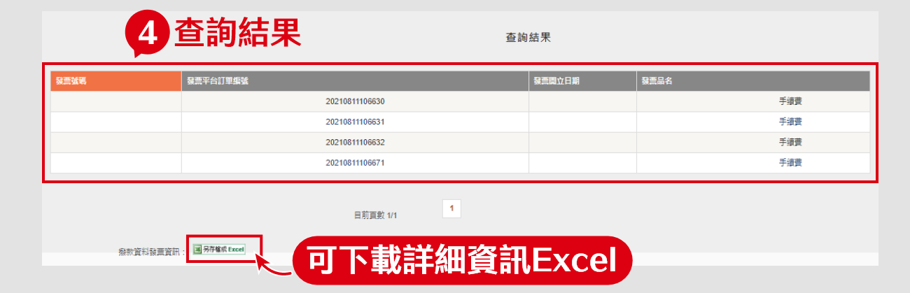

# 帳務資訊

::: tip 💡 摘要
PayNow 提供商店賣家請/退款對帳查詢、撥款手續費發票查詢...等帳務交易操作。
:::

::: tip 在此頁面中，你可以了解：
[[toc]]
::: 

## 如何查詢請/退款對帳

按照以下步驟
### 1. 點擊「賣家功能」

### 2.點擊「請退款對帳查詢」

### 3. 選擇欲查詢的年與月

### 4.資料顯示於下方

:::tip 備註
點擊圖示，可下載撥款明細的 Excel 報表。

此報表可看出本月的改成「請款金額扣除手續費及退款」，並計算出本月應收款項的總金額
:::

## 如何查詢手續費發票

按照以下步驟
### 1. 點擊「賣家功能」

### 2.點擊「撥款手續費發票查詢」

### 3. 選擇欲查詢的年與月

### 4.資料顯示於下方

:::tip 備註
點擊圖示，可下載撥款明細的 Excel 報表。
:::