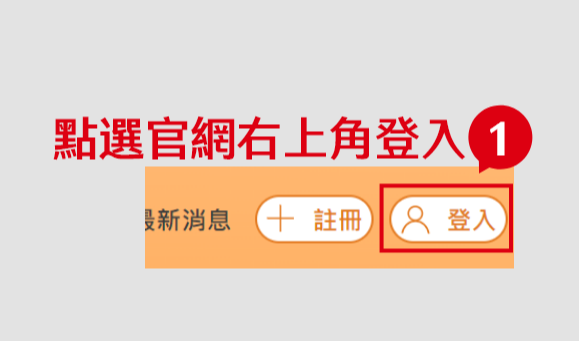
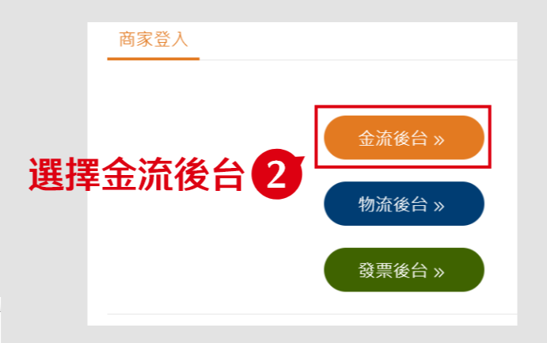
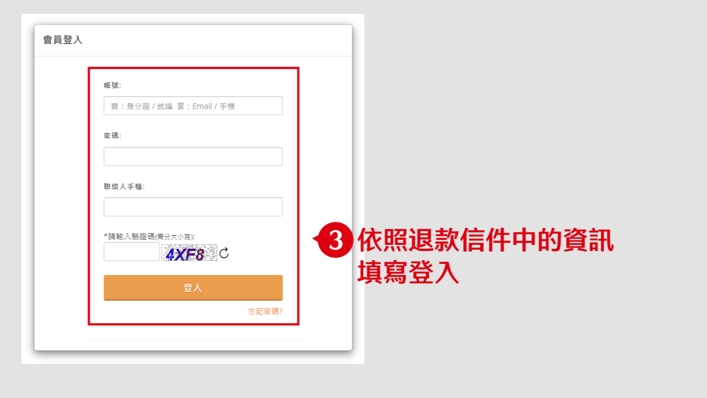
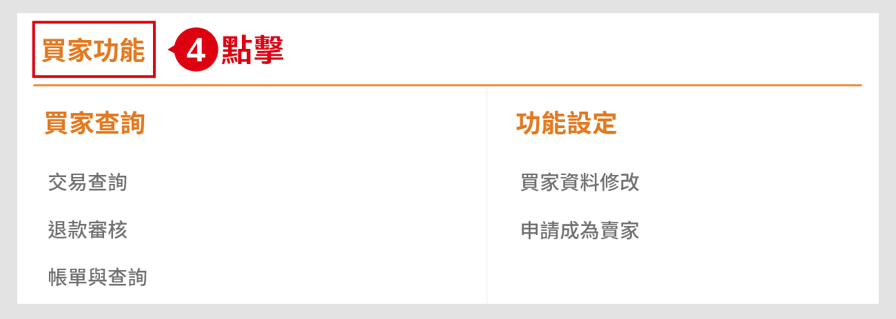
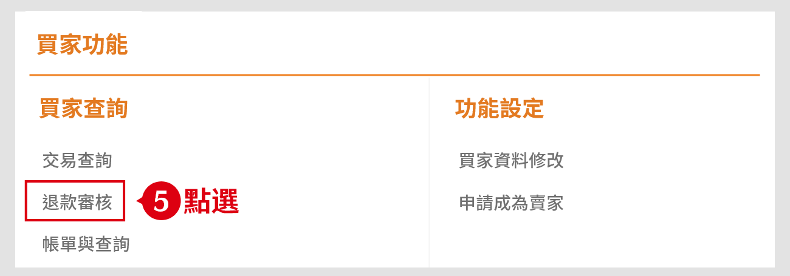
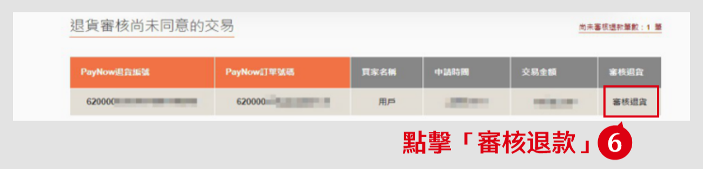
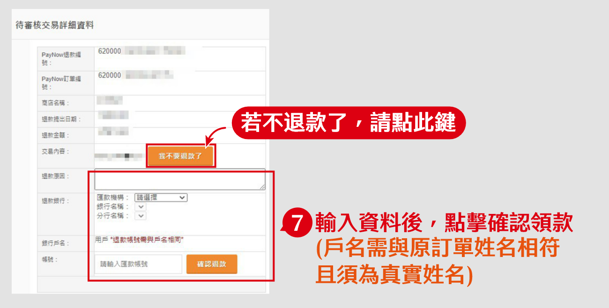

# ATM 退款設定

::: tip 💡 摘要
PayNow 提供買家使用 ATM 支付款項，若買家需要退款，可參考此頁教學。
:::

:::tip ❗ 前提條件
您的身分為「買家 (消費者)」。
:::

::: tip 在此頁面中，你可以了解：
[[toc]]
::: 

<!-- @TODO 我沒有加入「收取退款通知信」的流程說明，因為這邊的業務邏輯需要確認 -->

## 如何退款

按照下方步驟

### 1.登入官網
點擊官網右上角人像符號登入。

### 2.點擊「金流後台」

### 3. 登入 PayNow 系統
依照退款信件中的資訊填寫，登入 PayNow 系統。

### 4. 點擊「買家功能」

### 5. 點擊「退款審核」

### 6.點擊「審核退貨」

### 7. 點擊「確認退款」
填寫完成帳戶資訊後，點擊確認退款，即可完成退款資料填寫。

:::warning 請注意
1. 戶名需與原訂單姓名相符，且須為真實姓名
2. 送出前請再次確認戶名、銀行別、帳號資訊是否正確
3. 完成送出後，系統將會於 2-3 工作天內退款完成
