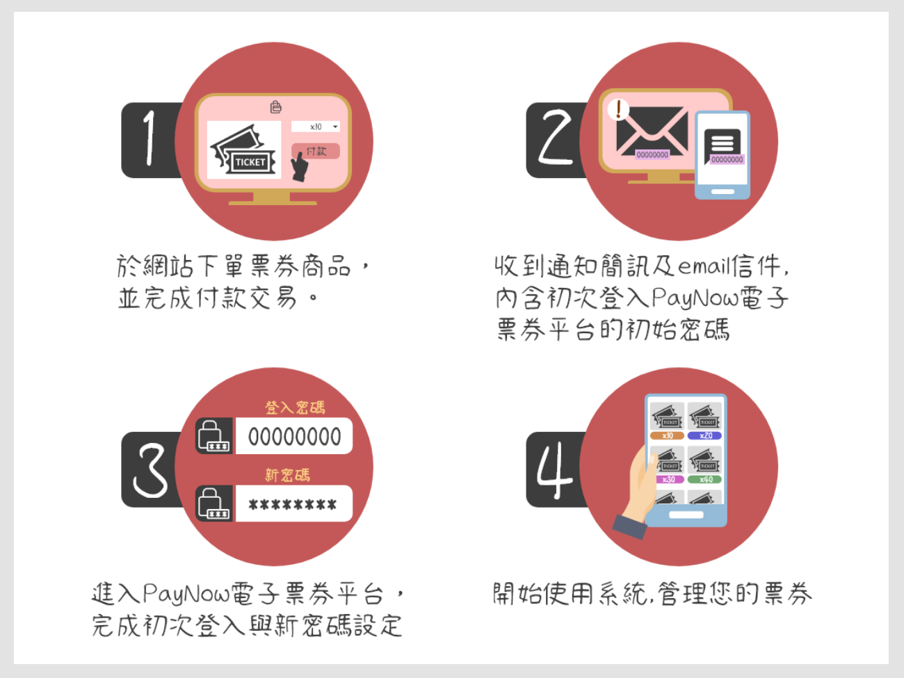
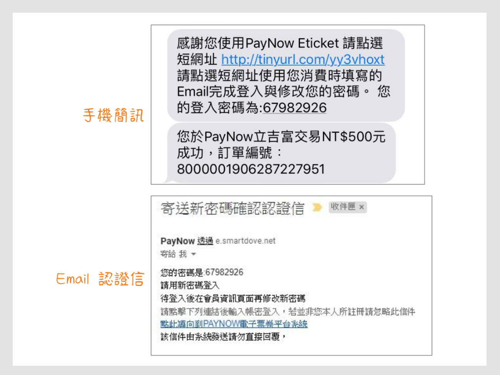
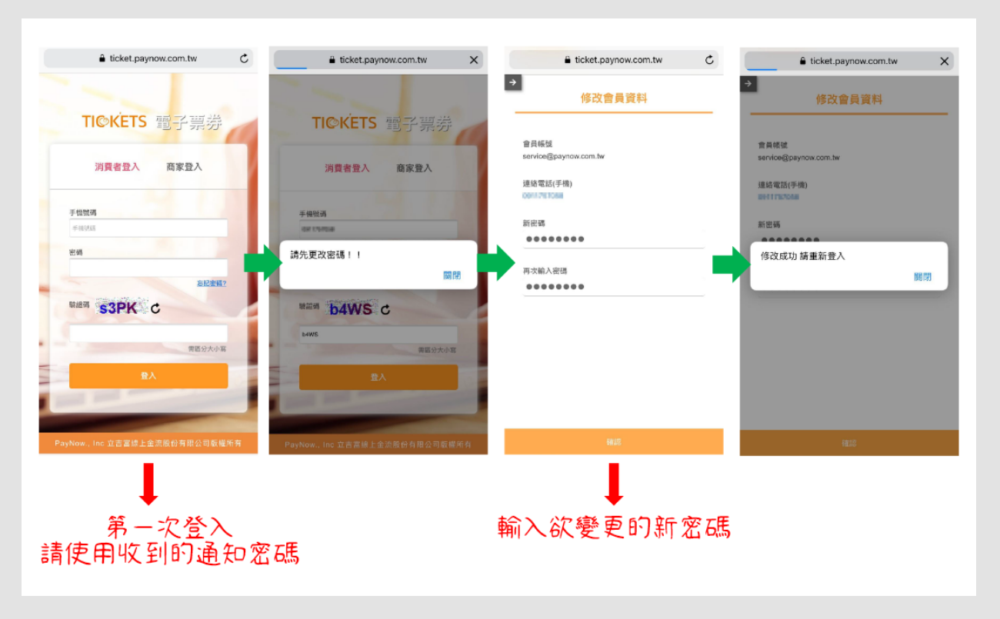
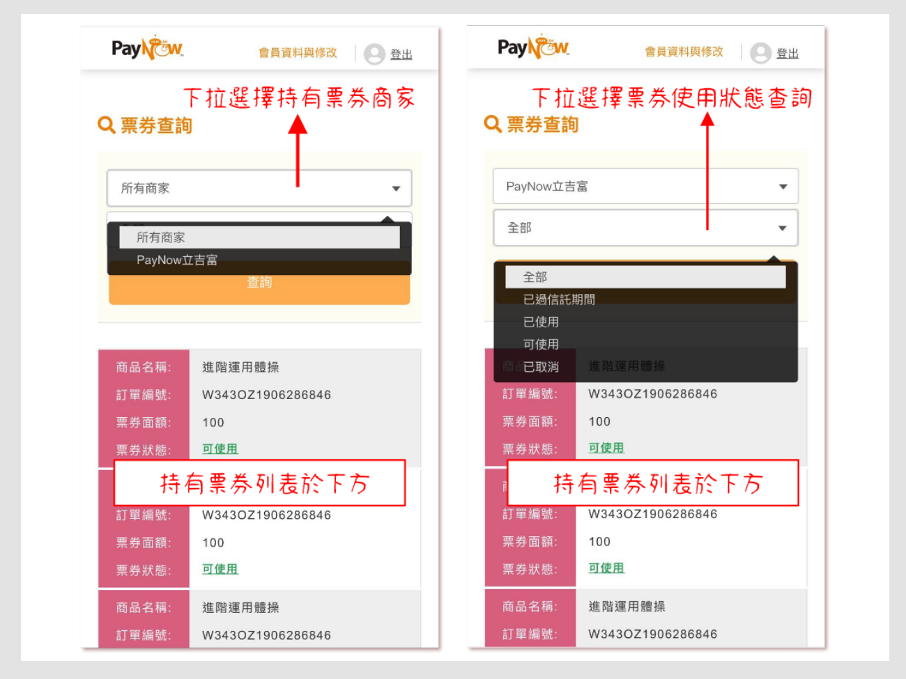
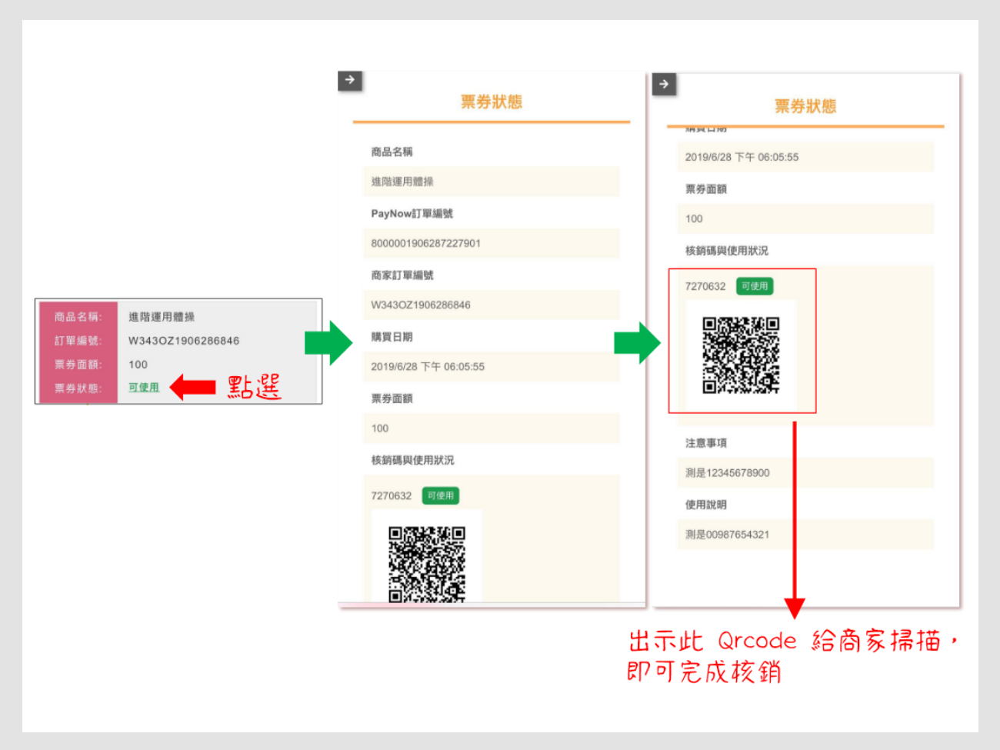
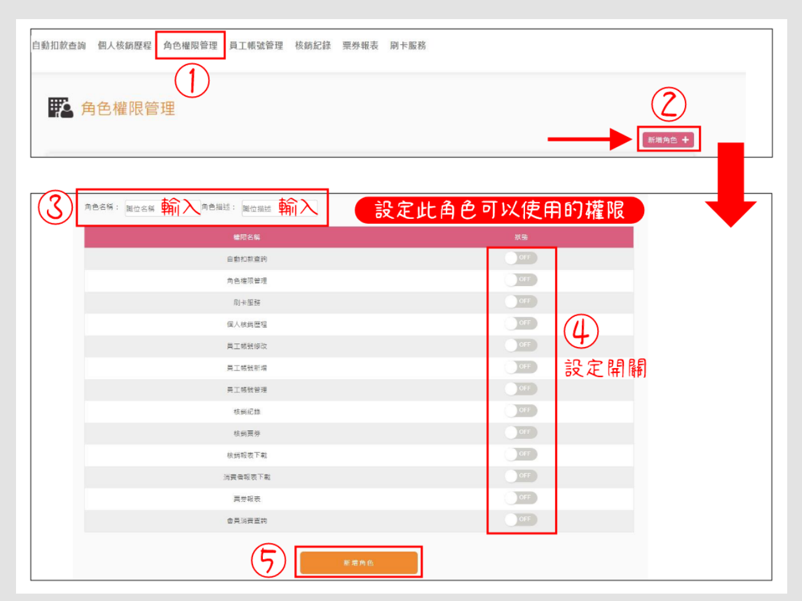
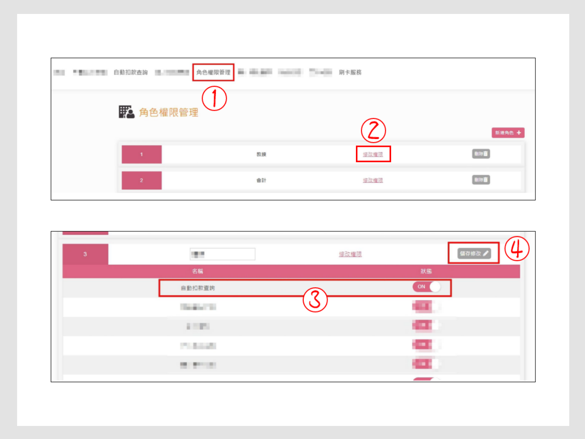
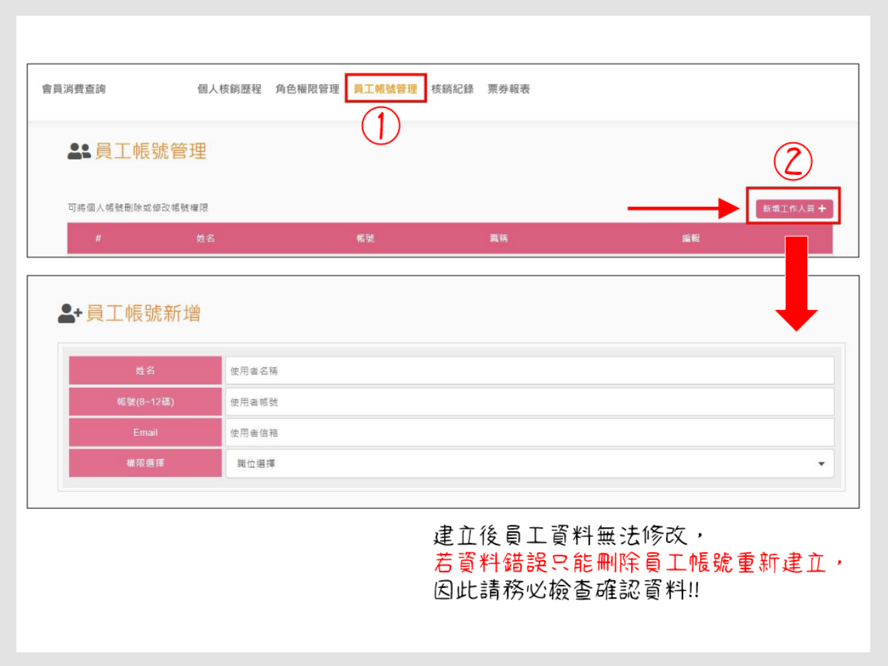

# 票券系統

::: tip 💡 摘要
電子票券是數位形式的票券，透過系統產生 QR 碼、並記錄到消費者的系統帳戶中。

PayNow 票劵平台提供完整銷售報表，會員管理及使用者權限功能。
:::

::: tip 在此頁面中，你可以了解：
[[toc]]
::: 

## 如何使用票券

:::tip ❗ 前提條件
您的身分為「消費者」。
:::

)

按照以下步驟

### 1. 搜尋並購買票券商品

### 2. 接收通知簡訊及 Email

### 3. 登入 PayNow 電子票券後台

初次登入平台時，請使用收到的通知密碼，之後再自訂新密碼並做變更。

### 4. 查看目前持有的票券

登入後可查詢並查看票券持有的票券，以及票券使用狀態。

### 5. 使用票券並完成核銷

點擊票券狀態的「可使用」，出示當中的QRCode給商家掃描，即可完成核銷。

<!-- @TODO 需補上操作畫面 -->

## 如何新增角色權限

:::tip ❗ 前提條件
1. 您的身分為「票券廠商」，並是最高權限帳號管理者。
2. 已經登入「PayNow 票券後台」

<!-- @TODO 補上PayNow 票券後台連結 -->
:::

按照以下步驟：
1. 點擊「角色權限管理」頁籤
2. 點擊「新增角色」
3. 開啟此角色需要的權限
4. 點擊「新增角色」

## 如何修改角色權限

按照以下步驟：
1. 點擊「角色權限管理」頁籤
2. 針對愈修改權限的角色，點擊「修改權限」
3. 修改權限
4. 點擊「儲存修改」

## 如何新增員工管理權限

:::tip ❗ 前提條件
您已 [新增角色權限](#如何新增角色權限)。
:::

按照以下步驟：
1. 點擊「員工帳號管理」頁籤
2. 點擊「新增工作人員」
3. 點擊「權限選擇」，分配角色權限給員工

:::warning 注意
員工帳號建立後，該員工資料將無法修改。

若資料錯誤，只能刪除員工帳號重新建立，請務必檢查後再建立!
:::

