# Shopify 串接

::: tip 💡 摘要
PayNow 與 Shopify 開店平台合作，打造多元化的付款閘道，搭配金流、物流、電子發票，讓您消費生活更便利。
:::

::: tip 在此頁面中，你可以了解：
[[toc]]
::: 

## 如何在 Shopify 上安裝 PayNow 付款閘道

按照以下步驟

### 1. 點擊安裝連結

點擊 [Shopify app store-PayNow](https://apps.shopify.com/paynow-2) 後，再點擊「新增應用程式」

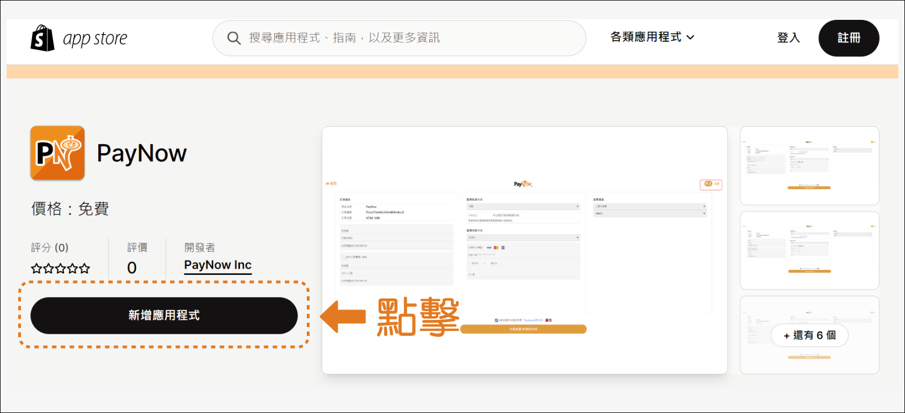

### 2. 點擊「安裝應用程式」

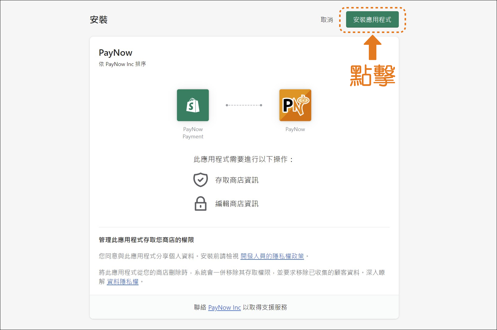

### 3. 點擊「管理」

在商店的「設置」中，點擊「付款」後再點擊「管理」。

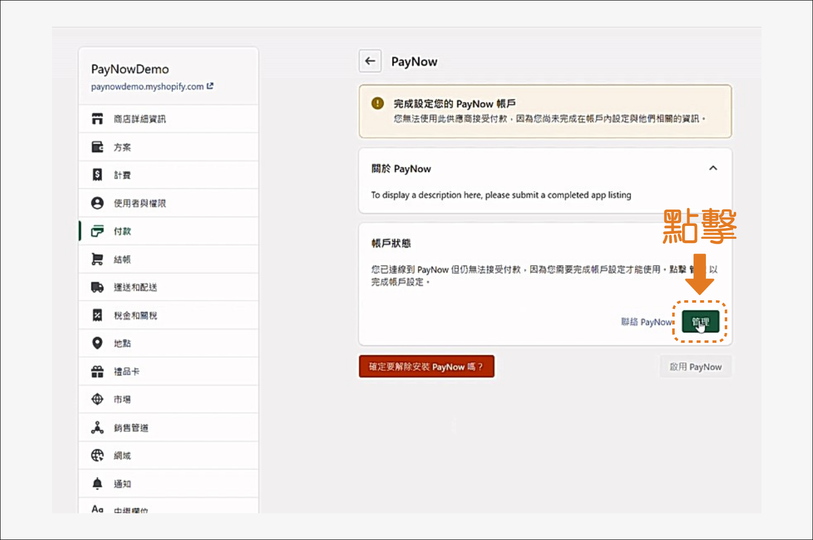

### 4. 綁定 PayNow

輸入 PayNow 的帳號與交易密碼，按下「綁定」。

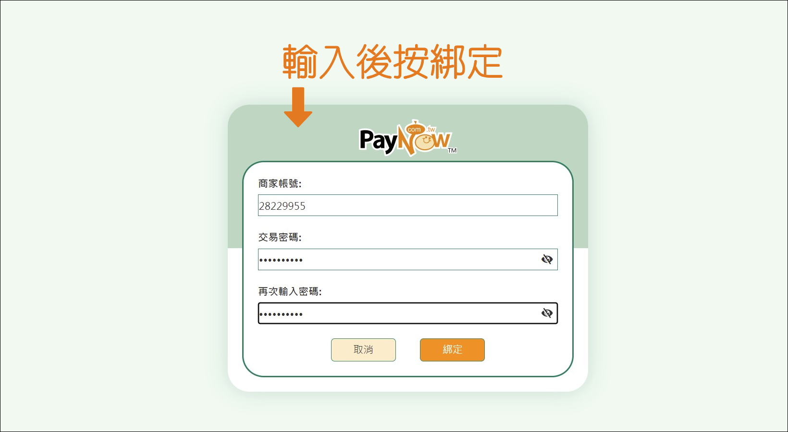

### 5. 完成安裝

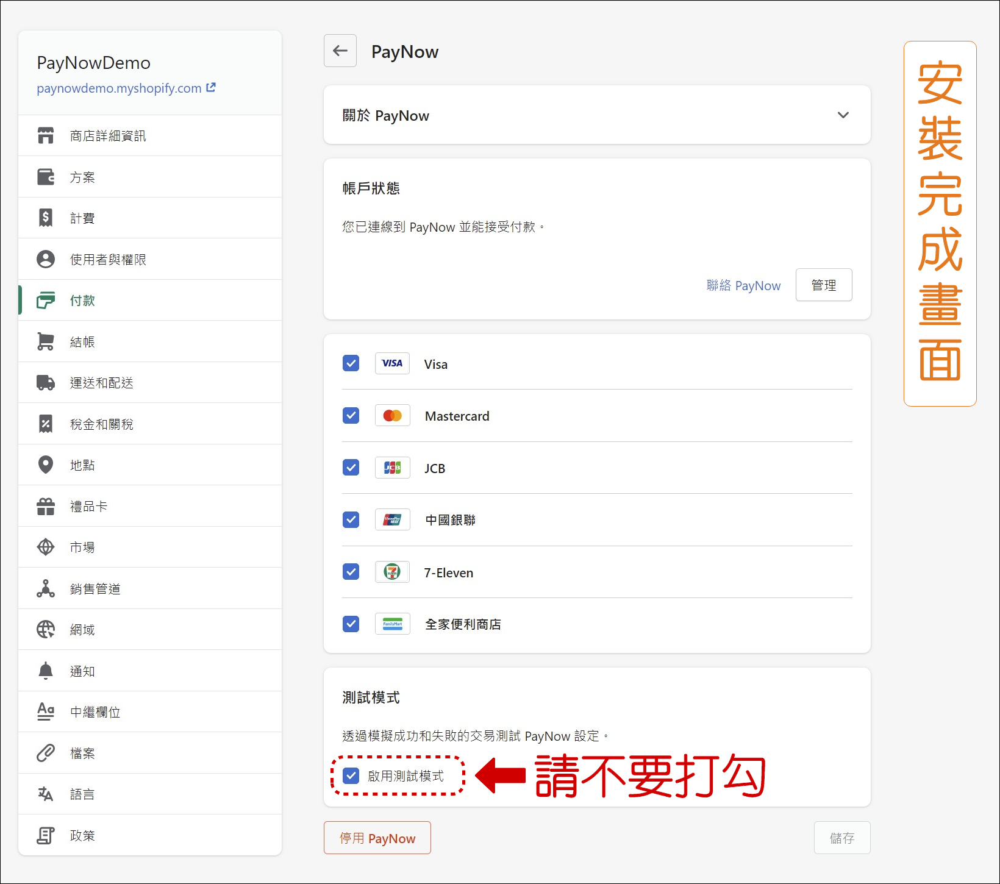

:::tip 備註
若要正式使用，請停用「測試模式」。
:::

## 如何在訂單列表上自動取得 PayNow 訂單訊息

在您的 Shopify 商店，PayNow 能自動抓取訂單的詳細資訊。

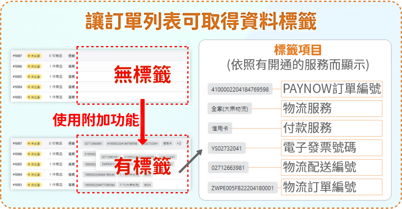

您必須完成以下兩大步驟設定
1. 設定憑證金鑰
2. 設定商店網址

### 步驟 1. 設定憑證金鑰

#### 1-1. 點擊「設定」，然後點選「應用程式和銷售管道」

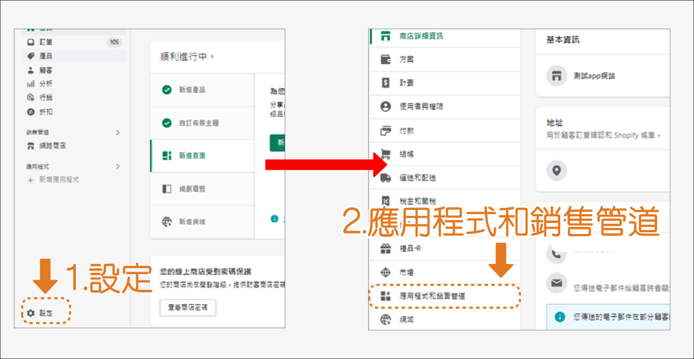

#### 1-2. 點擊「開發應用程式」

#### 1-3. 建立應用程式

點擊「建立應用程式」，輸入自訂名稱後按「建立」。

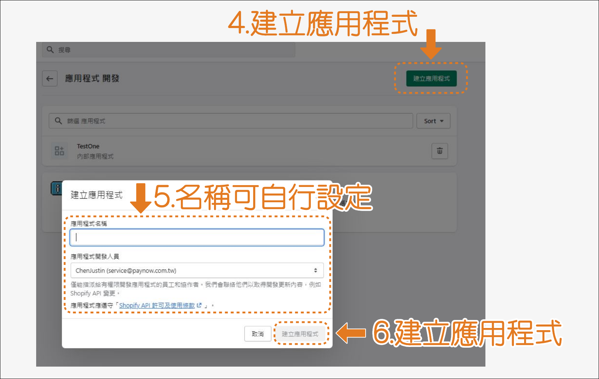

#### 1-4. 設定 API 整合

面板中進入「設定」選單，在管理介面 API 點擊「設定」。

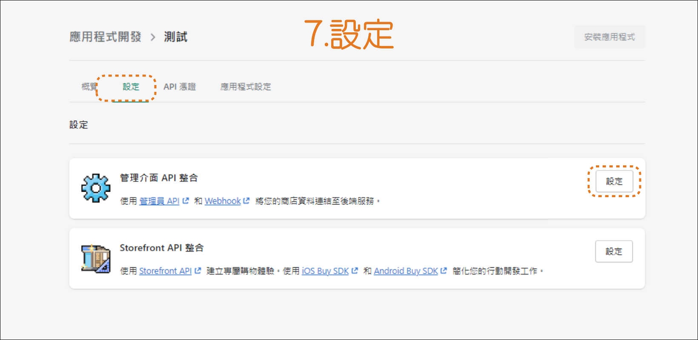

#### 1-5. 勾選指定的選項 (共 8 個)

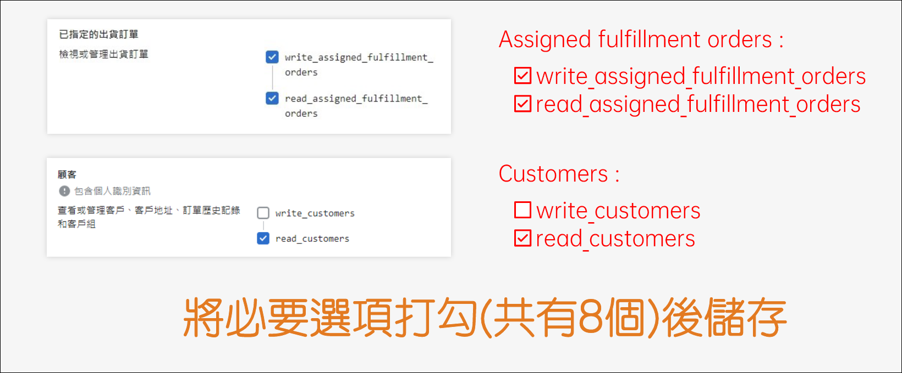

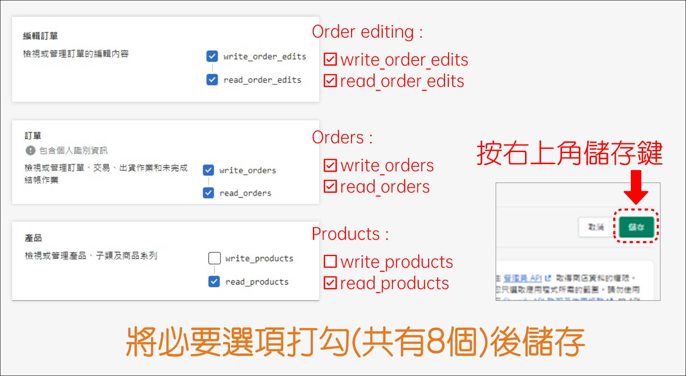

#### 1-6. 安裝應用程式

按照以下步驟：
1. 在「訂單管理」面板中點擊「API憑證」選單
2. 點擊「安裝應用程式」，安裝完成後就會出現憑證
3. 請提供此憑證給 PayNow 進行串接

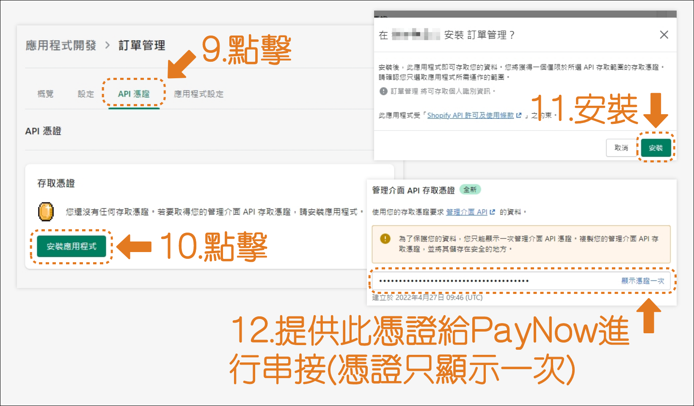

:::warning 注意
API 憑證僅會顯示一次。

若忘記複製，請點擊「解除安裝應用程式」並重新安裝。

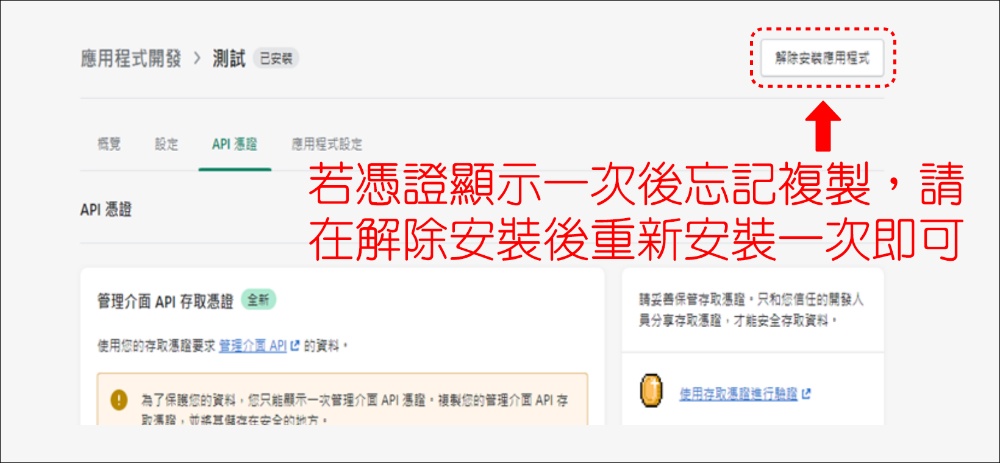
:::

### 步驟 2. 設定商店網址

點擊面版中的「設定」，並提供您的商店網址連結 (格式為 `xxx.myshopify.com` )。

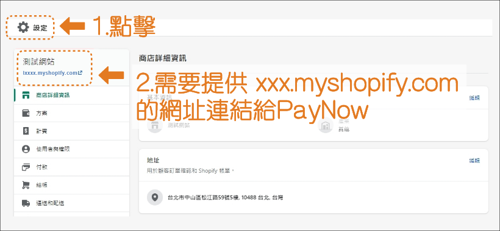