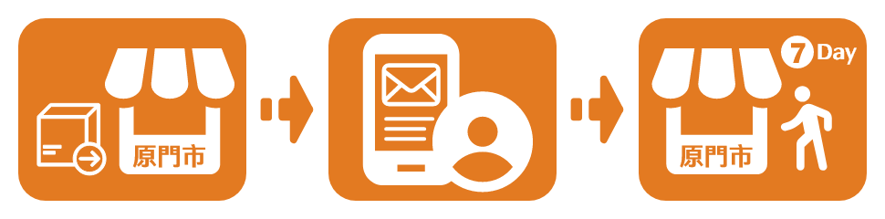
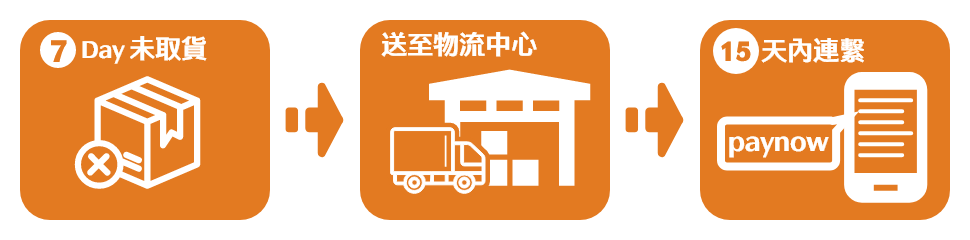
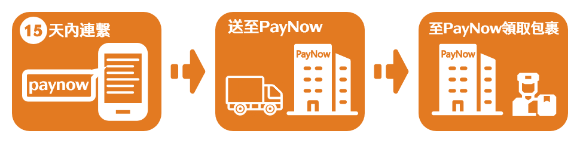

# 退貨流程

::: tip 💡 摘要
若您寄出包裹後但消費者未取件，包裹將會寄回到原寄件門市。

參考下方流程處理您的退貨。
:::

## 包裹退回到門市後 7 天內

包裹退回退回到寄件門市後，PayNow 會發送Email 與簡訊至寄件人的信箱與手機門號，請盡速在 7 天內至寄件門市領取。

## 包裹退回到門市後 7 天後

包裹退回寄件門市 7 天內未領取，將送往超商物流中心，此時訂單的狀態將會顯示 `退至物流總倉`。 

您必須在 15 天內盡速與 PayNow 聯繫，物流中心僅保管您的商品15天。

### 15 天內通知 PayNow
包裹將會由超商物流中心以貨到付款方式寄至 PayNow，其中產生的物流費用須由商店負擔，請通知您的物流廠商至本公司領取包裹。

### 15天內未通知 PayNow

物流中心將會銷毀您的商品。

